# Dayspring OS Complete Application Manual

User administration and technical operations reference

Edition 1.0 | 4 November 2026 | Primary website https://www.dayspring-vlbc.org

## 1 About this manual

Dayspring OS combines the DaySpring Chapel public website with a protected application for church administration, people, media, forms, certificates, reporting and operations. This manual explains how to use those functions, how responsibilities move between roles, and how to run and maintain the software.

The instructions describe the current source code and the workflows verified during the accompanying audit. A feature in the source code is not proof that the matching backend, migration, worker or environment setting has reached production. Check the release checklist before concluding that a live-site problem is a user error. External social accounts, payment arrangements, email services and hosting credentials remain separately configured services.

Use chapters 2 to 6 to get started, chapters 7 to 19 for everyday work, and chapters 20 to 27 for administration and technical operations. The route reference supplied with this manual identifies the actual pages and controller routes in this edition. Older delivery notes are historical; where they describe form publication approval, branch selection or session countdown screens, this manual takes precedence.

### Core operating rules

- Superadmin does not need approval for its own actions and may override any pending media approval stage. Normal validation, permissions, revision checks and immutable issued-file rules still apply.
- Other media users follow the next applicable level: creator or contributor, Church Media, Church Admin, Superadmin, then ready for publication.
- Form creators publish their own forms directly. There is no form publication approval queue.
- A form creator may manage and issue training certificates for that creator's own form. Church-wide certificate batches have a separate configurable approval process.
- Approval makes media eligible to publish. It does not automatically post to the website or to social platforms.
- Public website publication and social distribution are independent choices. An event may appear on the website first and be shared to selected social platforms later.
- The application is currently operated as one church. Department or unit assignment is not a promise of complete data isolation across all legacy modules.

## 2 Quick start by responsibility

### Superadmin

1. Sign in at `/admin/login` using your own account.
2. Open Roles & Permissions and review named roles, people assignments, visible resources and dashboard cards.
3. Confirm that the correct Church Media and Church Admin accounts can access their queues.
4. Review Operations for API, database, reporting and certificate-worker health.
5. Review media requiring final approval, or use your direct publishing authority when appropriate.
6. Check certificate issuance, revocations and the audit trail. Keep at least one active Superadmin account.

### Church Admin

1. Start with the dashboard and actionable menu badges.
2. Review appointments, requisitions and other operational work permitted by your role.
3. In Media > Approvals, open the Admin Queue, inspect the content, then approve and forward to Superadmin or return it with a correction reason.
4. Use Forms & certificates to manage your own forms and training attendance.
5. Review reports and refresh reporting data when needed. Comment moderation belongs to media and social personnel rather than the built-in Church Admin role.

### Church Media

1. Review the media library and contributor submissions.
2. Inspect files and program details before approving and forwarding to Church Admin.
3. Submit your own work directly to the next approval level. You do not need a second forwarding action just to start the workflow.
4. Track returned work, publishing-ready items and per-platform publishing results.
5. Manage your forms, training certificates and the Social & community inbox when the necessary capabilities are assigned.

### Contributors and social personnel

Contributors prepare and submit their work, track its stage, read correction comments and resubmit amendments. They cannot use Forward to bypass Church Media. Social personnel with publishing capabilities can use approved media created by other people, choose permitted channels and review delivery outcomes. A publishing role does not grant access to other creators' pending drafts.

## 3 Signing in and managing sessions

Open the website over HTTPS, then visit `/admin/login`. Enter the account email and password. The sign-in page offers password visibility and Remember me. A successful login loads current role and permission information and routes you to the protected application.

The browser receives an opaque HttpOnly session cookie. JavaScript does not receive a reusable JWT or refresh token. The API stores a hash of the session secret and rechecks current account access. Suspending access, removing the necessary role or changing the password affects subsequent protected requests.

### Inactivity and absolute expiry

The dashboard signs out after 30 minutes without user interaction. Typing, pointer interaction, touch and scrolling count as activity. Merely leaving a tab open, an automatic request or a background session check does not. Activity is shared across same-origin tabs. An active browser reports activity to the server at most once a minute; the server independently rejects idle credentials, including when the computer has slept.

Ordinary sessions retain a 12-hour absolute lifetime. Remembered sessions retain a seven-day absolute lifetime. These are maximum lifetimes, not exemptions from inactivity. Activity never extends the absolute limit. A successful new sign-in starts a fresh activity window.

Use Sign Out when you finish, especially on a shared computer. Confirm the sign-out prompt. If the server cannot confirm revocation, the ordinary sign-out flow reports the error so it can be retried. Inactivity still removes the protected browser view, and server-side expiry remains authoritative.

### Connection failures and login limits

A temporary network error or HTTP 429 does not prove that a session expired. The recovery view offers Try again and Sign in again; it has no countdown. Internally the client respects retry guidance and avoids repeatedly sending the same session check. The application verifies sessions on navigation, resume and reconnect rather than polling verification every minute.

Login abuse protection is separate from session duration. The backend limits repeated sign-in attempts per normalized account and also has a broader allowance for a shared proxy address. A blocked account does not consume every other account's individual allowance. Login writes are never automatically replayed. Do not repeatedly click Sign in while a request is still running.

## 4 Navigation and role visibility

The sidebar shows only resources the role may access. Resource visibility, action permissions and dashboard-card choices work together. Hiding a menu item does not replace API authorization, and entering a URL directly does not grant permission.

| Area | Purpose | Main address |
| --- | --- | --- |
| Dashboard | Role-specific overview and shortcuts | `/admin/dashboard` |
| Content | Website content management workspaces | `/admin/content` |
| Calendar | Monthly program calendar and selected-day agenda | `/admin/calendar` |
| Appointments | Pending and scheduled pastoral appointments | `/admin/appointments` |
| Requisitions | Operational requests and approval status | `/admin/requisitions` |
| Giving | Giving destination and bank account records | `/admin/giving` |
| Members | Member records and the content team | `/admin/members` |
| Units | Departments, units and content-unit designation | `/admin/units` |
| Small Groups | Group information and leaders | `/admin/small-groups` |
| Birthdays | Birthday records and date-based discovery | `/admin/birthdays` |
| Media | Library, programs, workflow, approvals and publishing | `/admin/media` |
| Social & community | Community inbox and social publishing | `/admin/comments` |
| Roles & Permissions | Roles, people, capabilities and dashboards | `/admin/permissions` |
| Insights & accountability | Reports and audit trail | `/admin/reports`, `/admin/audit` |
| Forms & certificates | Forms, certificates and certificate approval settings | `/admin/forms` |
| Operations | Service measurements, workers and jobs | `/admin/operations` |
| Settings | Hero, livestream, contacts and chatbot settings | `/admin/settings` |

Grouped sidebar headings expand their children. The old Church Access address routes users to People & assignments. A separate branch selector is not part of the intended church interface. Profiles and assignments use readable usernames and role names rather than asking operators to recognize GUIDs.

On a phone, open the sidebar using the menu button. Tables may provide cards, scrolling or compact actions. Use the application's navigation and save controls before leaving an editor. A disabled button may indicate a pending operation, a missing required field, a workflow state or missing permission; check the explanatory message rather than repeatedly submitting.

## 5 Using the public website

The public website provides the home page, church information, events, sermon and book library, gallery, giving instructions, appointment requests, newsletter subscription, forms and certificate retrieval or verification. Public pages may cache eligible public assets. Authenticated responses and private files must not be cached by the service worker or CDN.

### Home page and livestream

The home page combines the configured hero, church content and links to public sections. Hero media and livestream configuration are different settings. A hero video is not a live broadcast. Livestream cards depend on saved active flags and valid platform URLs; the Watch Online visibility control can hide the public entry point without deleting administrative records.

### Events

Only published event records with an approved flyer appear through the public event flow. The public window runs from the current day through the configured two-calendar-month upcoming window. Draft programs, outdated flyer revisions and events outside that window are not public merely because an administrator can see them in the calendar.

Open an event to see its published details. Program changes and replacement flyers return through the required approval process for ordinary users. A missing event should first be checked for publication, flyer approval, date and revision status.

### Library and gallery

The library presents configured books and sermons. Sermons may expose audio, video or supported YouTube playback, with preacher, date and series information. The gallery organizes published images into albums. Whether a resource is visible depends on a persisted record and usable media URL, not simply the presence of a local upload file.

### Giving and appointment requests

The giving page displays the church's configured giving destinations and account details. Revealing or copying an account number does not execute a bank transfer. The app is not, by itself, proof of payment or a bank settlement system.

For an appointment, complete the public form with the requested identity, contact and purpose information. Correct highlighted validation errors. A successful request enters the administration queue; it is not an automatically confirmed meeting. Staff choose the appointment time, responsible official and venue through the administrative process.

### Newsletter and chatbot

Newsletter submission saves a subscription through the API and reports success or failure. Subscription storage does not establish that an outbound campaign service is configured. The chatbot uses the church information and configured additional instructions available to its engine; treat it as a source of general church guidance rather than an authorization or financial decision system.

## 6 Dashboard calendar and birthdays

The dashboard displays the resources and cards selected for the user's role. The built-in roles have different responsibilities, and a custom role may have a deliberately smaller dashboard. Missing cards should be investigated in Roles & Permissions before treating them as missing data.

The greeting appears near the top of the content area. Cards may show media, workflow, administrative or operational measures. Counts represent stored records or service observations; they are not estimates of work that has never been recorded.

The calendar has month navigation, a Today action, individual day buttons and a day agenda. Select a day to inspect titles, times, descriptions and publication status. Internal planning visibility does not mean the same record is public. Calendar times use the browser's locale and timezone.

Birthdays are calendar dates. Use the birthday page to find the appropriate people, and check the underlying member profile if a date is wrong. Birthday badges should compare month and day without shifting a date-only value across timezones. Changes to names and dates belong in the member data rather than in the badge.

Menu badges show actionable pending counts. They follow capabilities, including custom roles, rather than relying only on the built-in role's name. A final reviewer with access to both approval queues can have both queues represented. Background badge refresh is separate from activity and does not prevent inactivity sign-out.

## 7 Members units and small groups

### Members and personal information

Use Members for member discovery and the member-management functions permitted to your role. Search before adding a duplicate. Keep identity, contact details and personal profile information consistent with the linked user account. Member records, user accounts and biodata are related records with different purposes; assigning a role does not automatically supply every missing profile field.

Open a member's record to use the available edit and assignment actions. Check the selected unit and small group before saving. Personal information, children and family details are administrative data; do not include private profile fields in a public media caption, public form receipt or public screenshot.

### Content team assignments

Content-team responsibilities are attached to appropriate members. The content-unit designation and the member's content role affect eligibility for functions such as graphics and social work. Church Media manages the content-team workflow using the capabilities assigned to that role. Platform-level role creation and general protected-account access remain controlled through Roles & Permissions.

Graphics staff may prepare event flyers. Contributors submit their work into the media review path. Social personnel need the appropriate publishing capabilities for the channels they will operate. A content-team label alone is not a substitute for the backend permission required by an action.

### Units

Open Units to create or update a unit name, description, head, code and phone information. Choose heads from the appropriate existing people when the interface offers a selector. The designated content unit is a special operational unit; do not change that designation casually while content-team memberships depend on it.

A person who needs a department- or unit-scoped role must have the corresponding membership link. Assignment scope controls eligibility for the role. Use existing unit-specific capabilities when data access must also be restricted to that unit.

### Small groups and children

Create or edit a small group with its name, description, leader, code and phone information. Assign a leader from the available people and review member links. Before deleting a group or unit, inspect any relationships and heed a server validation error rather than removing linked data indirectly.

Where child or family records are used, link the correct parent membership and maintain the child's own names and birth date. A blank search should list records normally. Search and pagination should not require a parent biodata record simply to show the child. Health-related family information should be handled as private member data.

## 8 Appointments requisitions and giving accounts

### Appointment administration

1. Open Appointments and identify a pending request.
2. Read the requester's purpose and contact details.
3. Confirm the correct official, future date and time, and available venue.
4. Use Confirm and check the resulting status.
5. If the meeting needs a different venue, use the venue update action.
6. If it cannot proceed, cancel it with a useful reason.

Do not interpret a submitted public form as a confirmed appointment. Dates are entered and displayed in the operator's local context but must remain consistent with the stored instant. Search should match the person's name regardless of case. Page two should contain the next records rather than repeating or omitting page one.

### Requisitions

A requisition records a requestor, description, unit and requested items. Quantities and unit prices must be positive. Review totals and the reference number, then approve only through an authorized action. Approved status should identify the approver and approval date. Superadmin-originated actions follow the approval exemption, while ordinary requests remain subject to their applicable process.

The current administrative screen is primarily a review and approval workspace. Do not assume it provides every procurement, invoice, inventory or payment function. A requisition approval authorizes an operational request; it is not proof that funds were disbursed or goods received.

### Giving accounts

Administrators manage account name, purpose, account number, bank name and description. Create a destination only after confirming the details with the church. Review edits carefully because the public giving page may display these records. Removing a destination removes its availability from the current account list; it does not cancel an external bank transfer.

## 9 Roles permissions resources and dashboards

Roles & Permissions has three main workspaces: Roles & dashboards, People & assignments, and Custom permissions. The former Church Access function is part of this area. Church access means who may use protected application resources, not a branch-registration workflow.

### Create or configure a role

1. Open Roles & dashboards and choose the creation or configuration action.
2. Give a custom role a meaningful name, such as Training coordinator.
3. Choose organization-wide, department or unit assignment scope.
4. Select the required capabilities.
5. Enable the resources that the role should see.
6. Select the dashboard cards that belong to its responsibilities.
7. Save, assign a test account and verify both permitted and denied actions.

Capabilities describe actions such as viewing responses, approving media or managing operations. Resources describe application areas. Dashboard cards describe information shown on the dashboard. Give all three deliberate settings; enabling a resource does not automatically grant every action within it.

Built-in role names are reserved. Their system-defined capabilities have additional protections. Superadmin must retain organization-wide access to the dashboard and access-management resources, and the system protects the final active Superadmin account from removal or suspension.

### Assign access to people

Search People & assignments using readable usernames, email addresses or role names. Select the intended role and, where needed, verify department or unit membership. Save and recheck the account. Suspension prevents protected access on subsequent requests; it is not the same as deleting the person's historical work.

Custom permissions are named bundles of registered application capabilities. A new label does not implement a new endpoint, invent a new dashboard or create unrestricted access. Select the underlying capabilities that the application actually supports.

## 10 Media library and content preparation

The media library is the working store for uploaded content and its current workflow stage. The publishing workspace is where approved content is sent to a website destination or social channel. Keep the distinction clear: uploading a file does not make it public.

Create media with a useful title, description, correct content type, category, source file or supported YouTube link, and any relevant thumbnail or tags. File and category validation is enforced on the server. Event flyers are graphics work; ordinary contributors need the appropriate graphics assignment or media-review authority.

| Media category | Typical use | Website destination |
| --- | --- | --- |
| Gallery | Images for an album | Gallery |
| Sermon audio | Recorded teaching or sermon audio | Library |
| Sermon video | Video or supported YouTube sermon | Library |
| Event flyer | Approved event announcement | Linked event |
| Event highlight video | Supporting event video | Event detail |
| Memory or short | Short video and eligible hero material | Depends on configured use |

Choose the correct category before submission. A linked event flyer retains the event identifier and event revision. Do not retarget it to another program in the publish dialog. Correct linked program information in Events & programs and use the proper flyer workflow.

Owners can edit submittable work subject to its state and permissions. Published and issued history is not a general-purpose scratchpad. Superadmin's exemption does not remove file validation, historical records or the requirement to preserve the correct event link.

## 11 Media workflow and approval queues

The standard path is Creator or contributor > Church Media > Church Admin > Superadmin > Ready to publish. Submission starts the process automatically. The starting point depends on the submitter's actual review authority: Church Media starts at Church Admin; Church Admin starts at Superadmin; Superadmin needs no further approval.

| Current responsibility | Action | Result |
| --- | --- | --- |
| Contributor | Submit for review | Church Media review |
| Church Media reviewer | Approve and forward | Admin Queue |
| Church Admin reviewer | Approve and forward | Super Admin Queue |
| Superadmin | Final approval | Ready to publish |
| Authorized reviewer | Return with correction reason | Creator's correction state |
| Creator of corrected content | Resubmit with optional note | Stage that requested correction |
| Superadmin at a pending stage | Override | Ready to publish |

### Review and send work forward

Open Media > Workflow to inspect pipeline items or Media > Approvals to open your actionable queue. The Admin Queue must list content currently at AdminApproval. The Super Admin Queue must list content currently at SuperAdminApproval. The queue does not depend on a decision record already existing; otherwise newly forwarded work would disappear until somebody had somehow acted on it.

Open View and check the actual file, title, description and linked event. Use Approve & forward to Superadmin at the admin stage. Final approval makes the item available for publication. Refresh queue or return focus to the page to retrieve recent changes. The queue also refreshes while it is visible.

### Return and resubmit

A return is a request for amendment, not a silent permanent deletion. Enter a specific correction reason, such as an incorrect date, spelling or flyer detail. The workflow returns to its creator, and the comment remains in history. The creator amends the work, adds an optional explanatory note and resubmits. It returns to the stage that requested the correction instead of restarting every earlier approval.

Do not approve twice from a stale tab. A conflict means the stage or revision changed after the view loaded. Refresh before acting again. Superadmin may override any pending stage, but the audit history still records that action.

## 12 Events and programs

Events and programs are managed together. A program may exist as a planning record without a flyer. A program with a flyer enters the media approval process before ordinary publication.

### Create a program and flyer together

1. Open Events & programs under Media or the corresponding Content workspace.
2. Choose New event / program.
3. Enter the title, description, date and time, plus any calendar-year assignment offered.
4. Add a supported flyer image if it is ready. The workspace accepts JPG, PNG or WebP flyers up to its 10 MB limit; hosting request limits may be lower.
5. Save. For ordinary users, a supplied flyer is submitted to the next approval stage. Superadmin's flyer is ready for publication directly.

### Add a flyer to an existing program

Find the existing program, choose Add / replace flyer, select the file and save. Use View flyer & workflow to track that exact flyer. Do not create a second program simply to add its image. The flyer and program stay linked through approval and website publication.

Changing program information invalidates the matching approved revision where the normal workflow requires it. A changed or replaced flyer needs the relevant new approval. The interface identifies a details-changed state so an old image cannot silently publish revised information. Planning records remain visible internally even when no public event is eligible to display.

## 13 Publishing to the website and social channels

Open Media > Publishing. Authorized publishers can select other creators' approved media. Pending work remains unavailable to ordinary publishers. The library can include ready, scheduled and website-published content; a website-published record remains usable for later social sharing.

### Publish to the website

Choose Publish for the media item. Confirm the destination and any destination-specific information. A gallery image needs its intended album; a sermon may need preacher and date information; a flyer uses its linked event. Check the details before submitting.

Social targets in a website publication are optional. If you want website-only publication, leave those targets unselected. Successful website publication marks the content published and makes it available through the relevant public destination, subject to public filters such as the event-date window.

### Publish to social platforms later

Return to the publishing library, including after a page reload, and choose Publish to social channels. Select only the permitted platforms. Choose Publish now or Schedule for later, enter a suitable caption and, for a schedule, a future date and time. Submit once and inspect the result for each selected platform.

Posting to social channels later must not create a second website event or republish its website destination. The server also tracks completed platform publication to avoid treating a retry as a request to repost every already successful channel.

### Delivery results and prerequisites

Facebook, Instagram, X, YouTube and WhatsApp capabilities are separate. An account may be authorized for one channel and denied another. Credentials, provider account eligibility and provider-side permissions are also required. A platform may reject an otherwise valid application request because of missing credentials, unsuitable media, a provider restriction or an expired provider token.

Review per-platform outcomes. Website success and social failure can occur in the same operation. Keep the committed website result and retry only the failed social work from the available history and retry controls. Do not recreate the original program merely because one external channel failed. No test in the audit intentionally sent a real public social post.

## 14 Social and community moderation

Social & community combines the community inbox with social publishing access. The built-in Church Media and social-media personnel are responsible for moderation. The built-in Church Admin and Superadmin roles do not receive the comments menu merely because they have a higher approval rank.

Use the inbox filters and counts to identify pending or hidden comments. Read the context before approving, hiding or deleting a comment. Use the provided confirmation for destructive actions. A moderation permission is different from the right to publish a post to a particular social account.

Not every item visible on a provider's website is necessarily an imported local comment. Availability depends on the comment integration and the stored data. Use Operations and provider configuration when a feed is unavailable rather than assuming the queue is empty. Keep personal information and unsolicited sensitive material out of public replies.

## 15 Creating and styling forms

Church Admin, Church Media and Superadmin can manage forms with their granted capabilities. A creator owns the form workspace and its training-certificate actions. Start at Forms & certificates > Form library, create a form, and give it a descriptive title and introduction.

The studio separates Questions, Theme, Settings and Certificate configuration. Save explicitly. An unsaved-change indication means that the current screen has changes that are not yet persisted. Preview shows the respondent presentation without making a draft public.

### Questions and sections

The builder supports text and long text, email and phone inputs, numbers, dates and times, choice questions, multiple selections, consent, ratings and scales, grid questions, hidden values, section breaks and private file uploads. Choose the type that matches the answer you need. A yes/no question should use an appropriate choice control rather than a free-text field if you want reliable counts.

Add sections to organize a long questionnaire. Respondents move with Back and Next and see progress. Required and format validation runs before advancing, and the server validates the final submission again. Answers remain while moving between sections.

Drag question handles with a pointer or touch, or use Move up and Move down. Moving a section moves its questions together. Move questions between sections deliberately. Conditional questions cannot be moved before the answers on which they depend. Removing a section keeps its questions; removing a dependency question is blocked while another question depends on it.

### Validation and conditional display

Private respondent uploads are limited to 5 MiB by the API, and a hosting proxy can impose a smaller request limit. Set Required only where an answer is genuinely needed. Use number bounds, character limits, supported upload types and maximum upload sizes where offered. Configure choice options with clear labels. Hidden fields and query parameters should not be treated as an authorization mechanism.

Conditional questions appear only when their configured rule is satisfied. Check both the visible and hidden paths in preview. A required question that is not relevant to the respondent must not make a legitimate hidden path impossible to submit.

### Theme and background

Choose a preset or configure accent colors, background colors or patterns, and a header image. Save the form to persist its theme. The studio accepts validated PNG/JPEG header images up to 300 KB and eight megapixels. The public form and protected preview use the same themed surface. Use sufficient contrast and review radio, checkbox and field alignment on a phone as well as a desktop.

## 16 Publishing sharing and controlling form collection

Each form has a standalone respondent page at `/forms/{id}`. It does not require respondents to navigate through church website menus. Saving a draft is separate from publishing it. The creator can publish directly without another administrator's approval.

| Control | Effect |
| --- | --- |
| Publish or reopen | Make collection available within its access and date rules |
| Suspend | Temporarily pause new collection while retaining data and the link |
| Resume | Remove suspension while preserving other collection restrictions |
| Stop collecting | Close collection until it is explicitly reopened |
| Collection period | Apply optional opening and closing instants |
| Archive | Retain history while preventing ordinary publication |

Set a collection start and end in the device's local time. The server stores instants in UTC and enforces the window on requests; it does not rely on a background worker to close a form. A suspended, not-yet-open, ended or stopped form shows a collection status rather than an active submission flow. The API applies the same restrictions to new uploads and submissions.

Choose public, authenticated or restricted access as appropriate. Restricted forms can identify permitted respondents. A public website listing is an additional choice; an unlisted but published public form may still be reachable through its link. Do not use obscurity of the link as a replacement for restricted access.

Use Share & settings to copy the link, configure collection and download a branded QR code. Test the QR after printing and ensure that its hostname is the intended production origin. A local preview URL is not a public invitation. Duplicating a form creates a separate form; it should not be expected to merge its results back into the original.

## 17 Reviewing responses and analyzing answers

Open the form's workspace to use Overview, Responses, Analysis, Share & settings and Certificates. The Responses badge shows the saved response count. Counts refresh during normal use; a saved response is distinct from somebody merely opening a page.

Use Responses to search, filter status or attendance, inspect answers and authorized attachments, and export results. Attendance confirmation identifies training completion or the attendance policy chosen for that form. It is not media approval or permission to publish the form.

Published form versions are preserved with responses. Editing labels or choices later does not rewrite the schema under which an earlier person answered. Expect exports and analysis to distinguish relevant historical definitions rather than silently reinterpreting old answers under a new question.

### Question-level analysis

Enable basic analysis in form settings when it is useful. The Analysis view describes the content of the answers, not just the number of daily submissions.

- Single choice and yes/no questions show each option's count and percentage, including options with zero selections.
- Multiple-selection percentages use respondents as the denominator. Because one person may select several answers, percentages can add up to more than 100 percent.
- Ratings and numeric scales show a distribution and the available numeric summaries, including average and median where appropriate.
- Grid or Likert-style questions show answer distributions for each row. Treat labels as ordered categories unless you have explicitly defined a numerical interpretation.
- Skipped or conditionally hidden questions are distinguished from actual answers.
- Free text and private upload fields are not converted into invented numerical sentiment scores or exposed as public content.

For example, if four people answer a yes/no question and three select Yes, the Yes count is three and its answer percentage is 75 percent. If two other respondents skipped the question, that is not the same as six people answering and half choosing Yes. Check each chart's answer and skipped counts.

### Exports

Use the response export action to retrieve a workbook for authorized analysis. Preserve the original export and work on a copy. Formula-like answer values are written as literal data rather than executable spreadsheet formulas. Current synchronous exports are limited to 10,000 responses and 500 historical columns. Use a smaller selection when a limit is reported; there is no unlimited queued export service in this edition.

## 18 Training certificates attached to a form

Enable the certificate option before collecting the responses that should receive private retrieval codes. Responses collected before that option was enabled do not automatically acquire a code later. Tell respondents to retain their private code and do not publish codes in screenshots or attendance lists.

### Prepare and issue

1. Open the creator-owned form's Certificates tab.
2. Upload a PDF, PNG or JPEG certificate background and position the available name, title, date and verification fields. The web editor accepts backgrounds up to 4 MB; hosting request limits may be lower.
3. Save the template version and preview its PDF.
4. Map the participant-name question and other supported fields.
5. Choose all eligible respondents or confirmed attendance only, with an optional answer filter.
6. Prepare the batch. Up to 1,000 participant PDFs can be prepared in one batch.
7. Watch generation status. A durable worker must be running to create the files.
8. Review the available generated output and recipient list, then explicitly issue.

The form creator can issue this form's training certificates directly. This does not grant that person unrestricted church-wide certificate issuance. Another creator cannot use an unrelated form, template or batch ID to obtain the same authority. Superadmin retains its approval exemption.

Generation and issuance are different states. A prepared or generated file is not necessarily downloadable by the respondent. A pending, unfinished or revoked certificate should not be treated as issued. Issued files are immutable; correct the source and use the supported new or revoked-record process rather than replacing an already issued PDF in place.

### Retrieval and verification

Respondents use `/certificates/download` and their private code to retrieve an issued PDF. Public verification uses a separate verification reference or QR link, such as `/certificates/verify/{token}`. Verification displays certificate validity and the intended certificate metadata, not the person's form answers or private download code.

Revocation requires an appropriate reason and permission. It blocks subsequent private downloads and marks public verification accordingly. Files somebody already downloaded cannot be remotely removed from their device. Automatic certificate email distribution is not configured as a general delivery guarantee in this edition.

## 19 Church wide certificates and administrative approvals

Church-wide certificate batches are managed in Certificates rather than through a creator-owned training-form shortcut. Template permissions, generation permissions, record viewing, approval, issue and revoke are separate capabilities.

Create a named template, upload the supported background and configure the positioned fields. Preview with realistic long names to check wrapping and placement. Template versions preserve the design used for generated records. Recipients may come from manual entries, a validated workbook or eligible form responses. Preview an import and correct errors before generating a large batch.

A durable job tracks generation status, progress, attempts and errors. The worker renews its lease and can resume after interruption while preserving completed outputs. Do not create another batch merely because a browser lost the response; the preparation operation supports an operation key to recover the existing result.

### Configurable approval

Approval settings apply to church-wide certificate batches. Configure one to five stages, stage names, registered permission requirements, optional assignees and prevention of requester self-approval. A custom stage name does not grant the named person permission by itself.

Ordinary requesters submit a generated batch for the configured approval process. Reviewers approve, return or reject with the relevant reason. The immutable decision history records the outcome. Once the required approval is complete, an authorized issuer releases the batch. The system rejects issuance while generation is unfinished. Superadmin may bypass its own approval requirement and override pending stages, while generation and immutable-file safeguards remain in force.

Use Certificate approvals for certificate requests. The broader administrative approvals view and workflow configuration are not substitutes for the separate media approval queues. Ordinary forms have no publication approval requirement, and creator-managed training certificates do not inherit a church-wide approval requirement simply because this configuration exists.

## 20 Reports audit trail and operations

Insights & accountability groups two different tools. Reports summarize operating records; Audit trail identifies recorded changes and decisions. Neither should be confused with the runtime logs used by developers to diagnose a failed request.

### Reports

Choose monthly, quarterly, half-year or annual reporting, the year, and the corresponding period. Reports include the media workflow funnel, uploads by category, contributors, social platform outcomes, requisition status and appointment status. Use the available PDF export for the selected report. The reporting store may be refreshed asynchronously; inspect freshness before interpreting a quiet period as no activity.

Use the reporting refresh action when permitted. A successful refresh should be followed by reloading the report. If fresh live records still appear absent, check reporting database connectivity and synchronization rather than changing the source records to manufacture a count.

### Audit trail

Search or page through recorded actions, actors, subjects and timestamps. Use the audit to answer who acted and what state changed. Keep it separate from diagnostic application logs and do not clear accountability records just to reduce console noise. Some legacy modules have narrower historical coverage than the newer administrative workflows.

### Operations

Operations presents actual service measurements for API requests, the main database, reporting synchronization and certificate work. It shows request and error measures, response times or synchronization age, worker heartbeats, durable jobs, progress and retries. Read a chart's unit before comparing services: milliseconds, age and queue counts mean different things.

Measurements are collected about once a minute, retained for seven days and viewed over one, six or twenty-four hours. The page refreshes about every fifteen seconds. No current sample is Waiting, rather than proof that a service is healthy. Users with job-management permission may retry eligible failed jobs. Repeated failure requires correcting the underlying data, renderer, connection or worker configuration.

## 21 Website and livestream settings

Settings exposes the functions permitted by the role. Hero, livestream and chatbot controls use separate backend permissions. Social contact links are public information; provider access tokens are deployment secrets and are not ordinary public settings.

### Hero

Choose the supported hero mode, upload eligible media or select suitable stored memory/short media, and save. The API validates supported formats, a minimum 1280 by 720 image size and the intended 16 to 9 aspect ratio. Image collections support up to ten images. Video hero material must meet the configured supported video-format and size rules; an arbitrary media URL is not proof of suitability. Image hero mode supports a validated collection rather than an unlimited upload list. Reset returns to the supported default configuration.

### Livestream and public contacts

Configure supported YouTube, Facebook or Instagram stream URLs and descriptions. Set Active only for the intended stream state. Maintain public Facebook and Instagram links, WhatsApp contact number and the YouTube channel identifier where offered. Save after editing. It must also be possible to save all streams turned off or links cleared; clearing settings is a legitimate change.

The public livestream read route and protected write route must use the same `BACKEND_API_URL`. Otherwise the dashboard can appear to save successfully while the public home page reads another service. The write route must accept the browser's HttpOnly session through the server and enforce the exact trusted origin; it must not require JavaScript to recover a removed browser JWT.

### YouTube broadcasts and announcements

Starting and stopping a YouTube broadcast require both application permission and valid provider credentials. A returned stream key or ingestion URL is sensitive operational information; keep it out of public screenshots and manuals. Confirm the desired broadcast before starting it, configure the encoder as required, and stop it through the authorized control when finished.

Announcements can target selected configured social platforms. Review the actual target selection, text and image. Provider credentials must be configured before a channel can succeed. Per-platform errors or skipped results should be reported honestly. Do not use a live church account for an automated test without explicit authorization to publish.

### Chatbot information

Maintain concise, accurate public information and additional guidance. Save through the authorized chatbot setting. Avoid storing account passwords, private member records or social access tokens in chatbot text, since it is intended to support responses to public enquiries.

## 22 Daily weekly and monthly operating checklists

### Every working day

1. Sign in using your own account and check the dashboard and permitted queue badges.
2. Review pending appointments, requisitions, media corrections and approval requests assigned to your responsibility.
3. For training, inspect current collection dates, saved responses and attendance confirmation.
4. Check failed publication outcomes and eligible certificate jobs. Retry only after understanding the error.
5. Before public release, verify the title, date, flyer and selected channels.
6. Sign out when finished on a shared device.

### Each week

Review user assignments and suspended accounts, unprocessed corrections, upcoming program dates, expiring collection windows, certificate progress and reporting freshness. Check public links and printed QR codes. Confirm who is responsible for each social account and that the church can recover its own provider access.

### Each month or reporting period

Review the selected reporting period, export required records, confirm that scheduled backups completed and perform the agreed restore verification. Review permission changes and audit records. Check logging retention, file growth and the worker's service status. Test an authorized form-and-certificate flow in a non-production environment before a significant release.

## 23 Architecture and runtime responsibilities

The frontend is a Next.js App Router application using React. It needs a running server because authentication, API proxying, chatbot and related route handlers are server functions. A static-only S3 export cannot replace that runtime. Static assets may be served through a suitable CDN, while private session and proxy responses remain uncached.

The API is an ASP.NET Core 8 application with Entity Framework Core and PostgreSQL. JWT API clients remain supported, but the browser application uses database-backed opaque sessions. Cloudinary supplies configured media storage. Certificate rendering uses private storage and native rendering dependencies rather than publishing recipient PDFs as general gallery assets.

The main `DayspringDbContext` stores operational data. `ReportingDbContext` stores reporting data, including migration history in the `reporting` schema. A reporting connection can point at a separate database or use the configured fallback. Inspect the correct connection and schema before concluding that the reporting migration created no tables.

Execution mode can be Api, Worker or Combined. Api runs request handling and service monitoring without the ordinary background worker workload. Worker runs the background processing role. Combined supports a single-process deployment. Separate workers must use the same intended database and stable certificate-code key as the API.

Durable certificate jobs persist before processing starts. Workers coordinate using leases; reporting and event-retention work use database coordination. A free host that sleeps or a stopped worker can delay jobs without deleting their persisted definitions. Operations and readiness checks help distinguish unavailable processing from missing work.

## 24 Configuration reference and secret preservation

Configure values in the intended hosting environment. Do not copy production credentials into screenshots, support chats, public repositories, generated manuals or `NEXT_PUBLIC_` settings. The following names are configuration keys, not usable credential values.

| Setting | Purpose |
| --- | --- |
| `BACKEND_API_URL` | Server-only frontend address of the intended API |
| `APP_ORIGIN` | Exact trusted public origin, normally `https://www.dayspring-vlbc.org` |
| `APP_ORIGINS` | Optional comma-separated additional exact trusted origins |
| `NODE_ENV` | Production enables secure browser cookie behavior |
| `ConnectionStrings__DefaultConnection` | Main PostgreSQL connection |
| `ConnectionStrings__ReportingConnection` | Reporting PostgreSQL connection |
| `Database__ApplyMigrations` | Whether the process performs startup migrations |
| `Execution__Mode` | Api, Worker or Combined |
| `Jwt__Issuer` and `Jwt__Key` | API token validation and signing configuration |
| `Bootstrap__Email` and `Bootstrap__Password` | First-administrator setup on an empty installation |
| `Frontend__Origin` | Canonical links generated by the backend |
| `Certificates__DownloadCodeKeys__primary` | Stable private-code cryptographic key |
| `Certificates__PdfRenderer` | Optional explicit PDF background-renderer executable |
| `Cloudinary__CloudName`, `Cloudinary__ApiKey`, `Cloudinary__ApiSecret` | Configured external media storage |
| `SocialMedia` settings and server-only provider variables | Per-service social publication credentials |

Preserve existing social credentials during deployment. A code release must not replace them with empty examples or developer values. Preserve the certificate download-code key as well: changing it carelessly can invalidate existing retrieval codes. Use the provider's managed secrets mechanism and the application's supported key configuration for any planned rotation.

For fresh installs, supply a strong operator-defined bootstrap password of at least the configured minimum. An existing administrator password must not be reset just because a deployment runs the seeder. After deployment, verify access using the intended account rather than assuming an example credential is valid.

## 25 Migrations release and rollback

Back up the intended databases and preserve deployment configuration before releasing a schema change. Read the migration first. Migration generation does not apply a migration, and applying the main context does not implicitly apply the reporting context.

### Command line

From the backend repository, use the correct project and context. Replace descriptive names with the intended migration name; do not generate a new migration merely to apply existing committed migrations.

```text
dotnet ef migrations list --project src --context DayspringDbContext
dotnet ef database update --project src --context DayspringDbContext
dotnet ef migrations list --project src --context ReportingDbContext
dotnet ef database update --project src --context ReportingDbContext
```

For a new model change, generate the main migration with the main context, or the reporting migration with `--context ReportingDbContext --output-dir Migrations/Reporting`. Review the diff and generated SQL. Never point a development scaffolding or smoke-test command at production by accident.

### Visual Studio Package Manager Console

Select the API project as the intended project and startup project. Use `Get-Migration -Context DayspringDbContext` and `Update-Database -Context DayspringDbContext` for the main context, and the equivalent commands with `ReportingDbContext` for reporting. To create a genuinely new migration, use `Add-Migration DescriptiveName -Context DayspringDbContext` or `Add-Migration DescriptiveName -Context ReportingDbContext -OutputDir Migrations/Reporting`.

### Release order

1. Confirm backups, stable secrets and the intended connection targets.
2. Apply reviewed main and reporting migrations. The inactivity-session feature requires `BrowserSessionIdleTimeout` in the main context.
3. Deploy the API and verify `/health/live` and `/health/ready`.
4. Start compatible workers and verify their heartbeat and native certificate dependencies.
5. Deploy Next.js using the correct API URL and exact public origin. Redeploy after changing host environment values.
6. Test sign-in, permissions, a safe local or staging workflow and the public read pages.
7. Monitor errors, job progress and reporting freshness before considering the release accepted.

Do not roll back a database casually after new records have been written. Review whether the earlier application version understands the new schema and stored records. Restore from a tested backup or use an explicitly reviewed compatible rollback plan. Static frontend rollback does not repair a backend migration failure.

## 26 Logs storage backup and service health

Application logs and database audit records are different. Runtime logs help diagnose errors and request correlation. Audit records preserve accountability. Console logs collected by a host consume the host's log allocation; locally redirected files consume local disk. Reading a cloud log page does not itself mean the entire deployment is stored on the viewer's PC.

Keep warnings and errors. Reduce repetitive successful database-command logging in production when it is not needed, and set a bounded retention or rotation policy for files and host logs. Do not delete PostgreSQL data directories, certificate storage, backup files or audit tables as a way to clear a console warning. Investigate repeated failures before suppressing them.

Back up the main database, the separate reporting database if used, private certificate and upload storage, and the configuration recovery material held in the appropriate secure store. Confirm that certificate keys and private files correspond to the restored database. A database backup alone cannot reconstruct a missing private PDF or a lost cryptographic key.

Use `/health/live` to determine whether the process responds and `/health/ready` to inspect operational readiness. A 404 at the API root is not, by itself, a failed health check; use the configured health endpoint. On a hosted service, verify the service's configured health-check path and the final deployment status rather than interpreting one interleaved restart line in isolation.

Persistent ASP.NET Data Protection key warnings deserve a deployment decision when protected features depend on those keys. Opaque browser-session records also depend on the database and credential stamp. Do not assume that silencing a warning creates durable key storage or encryption at rest.

## 27 Troubleshooting and support

### Invalid request origin at login or save

Confirm the exact browser hostname and HTTPS scheme. `APP_ORIGIN` must be an origin such as `https://www.dayspring-vlbc.org`, without an `/admin/login` path. Add another legitimate origin explicitly in `APP_ORIGINS` if it is genuinely needed. Redeploy after changing environment values. Do not disable origin checking or trust arbitrary forwarded-host headers.

### Too Many Requests

Inspect whether the request is a login POST or a session GET, its response message and `Retry-After`. A login limit is not a session duration. A session GET has no application login policy; a 429 there may originate from hosting or another upstream rule. Report the `x-dayspring-session-source` and correlation identifier when available, but never share the cookie. Avoid repeated clicks or automatic write retries.

### Signed out after leaving a tab open

Thirty minutes without interaction is the inactivity policy. A remembered session is still subject to it. Sign in again to create a fresh activity window. Do not treat a temporary network error as proof of expiry; actual unauthorized responses and server-side idle checks are different conditions.

### Forwarded media missing from a queue

Check the item's workflow status. AdminApproval belongs in the Admin Queue; SuperAdminApproval belongs in the Super Admin Queue. Refresh, confirm the reviewer's permission and verify that the backend queue fix is deployed. A pending queue must be built from workflow state rather than waiting for a decision record to exist.

### Approved event absent from the website

Check whether final approval has been followed by explicit website publication. Confirm its date is inside the public window, its flyer is attached to the correct event and revision, and the record is not archived. Approval alone does not publish it. Social-only publication does not publish the website event.

### Website event cannot be shared later

Look in the publishing library for website-published content and select Publish to social channels. Confirm the person's channel permissions. Earlier versions restricted this selection to ready-only items; deploy the matching UI and approved-publisher visibility fix rather than creating a duplicate event.

### No response count or question analysis

Confirm that a submission actually saved, that the form and version are correct, and that the viewer has response or analytics permission. Enable analysis if it was disabled. A form visit is not a saved response. Historical question definitions can produce separate groups, and skipped questions must not be mistaken for No answers.

### Certificate stays pending or generation stops

Inspect whether the state is awaiting generation, approval or issuance. Confirm that a compatible worker is running, the job is not failed, private storage is writable and the PDF renderer and fonts are installed. Correct the reported error, then retry the existing job. Do not issue an unfinished batch or create duplicate batches to hide a processing problem.

### Private code fails or verification says revoked

Check the code privately, the correct form, issuance status and revocation state. A certificate option enabled after submission does not retroactively issue a private code. Verify that the deployment still has the correct download-code key. A revoked certificate is deliberately unavailable and should not be restored by editing its stored file.

### PostgreSQL password or connection-string errors

Check the correct environment-variable name and use the database provider's current connection values. Include the required separators between `Database`, `Username`, `Password` and TLS options. Do not append an unmatched quote. A password containing connection-string syntax must be represented with valid connection-string quoting. Never paste the full secret string into a support message.

### PostgreSQL TLS handshake fails

Check the exact hostname, installed CA certificates and chosen verification mode. Use the correct managed database hostname and a working trust store. Certificate hostname or trust failures should be diagnosed, not hidden by blindly disabling TLS verification. A runtime container needs the trust-store update in its final image, not only in a build stage.

### No reporting tables

Confirm `ConnectionStrings__ReportingConnection`, the database selected in the provider's browser, and the `reporting` schema. Review `ReportingDbContext` migration history. Startup success is stronger evidence than a single initial migration-history probe failure; inspect the subsequent final exception or successful completion message.

### Save appears to succeed but public settings do not change

Confirm that all server routes use the same server-only `BACKEND_API_URL`. Check the stored backend response, public page freshness and host environment. Saving all streams inactive or clearing their links must remain allowed. An empty public fallback during an outage does not prove that a write saved to the intended service.

### Prepare a useful support report

Include the feature, your role, the time and timezone, safe steps to reproduce, expected and actual behavior, request method and path, status code, correlation identifier, relevant non-secret error text and whether retrying changed persisted state. Mask names and personal answers in screenshots. Never include passwords, session cookies, private certificate codes, access tokens or full connection strings.

## 28 Limits and acceptance boundaries

This edition does not claim that every external account or production deployment has been tested. The code and local audit can verify authorization, persistence, workflows and synthetic provider outcomes; live provider posting requires a configured authorized account and deliberate release acceptance.

Important current boundaries are the 1,000-recipient preparation batch, 10,000-response and 500-column synchronous export limits, hosted upload request limits, private-code rather than guaranteed email certificate delivery, and assignment scope rather than universal legacy data partitioning. Automatic orphan-upload retention cleanup and a general queued large-export pipeline are not supplied as completed features.

External social APIs can impose their own media, account, quota and approval rules. Database migrations, native certificate dependencies, private storage, workers and stable keys are deployment requirements. A missing external prerequisite cannot be fixed safely by inventing credentials or overwriting the church's existing secrets.

## 29 Release acceptance checklist

- Confirm the exact production origin and API address.
- Verify main and reporting migrations against their intended targets.
- Sign in and confirm inactivity expiry, explicit logout and current permissions.
- Use a contributor and reviewer to test submission, correction, resubmission and both approval queues.
- Verify final approval makes the item available to an authorized publisher.
- Publish an authorized test event to the website and confirm the public date window.
- Verify separate social target selection without issuing an unintended live post.
- Create, theme, reorder and publish a form; test sections, required fields and collection dates.
- Submit an answer, confirm the response badge, inspect question analysis and export a workbook.
- Generate a permitted test certificate, issue it, retrieve it privately and verify revocation.
- Verify custom role resources, dashboard cards and denied actions.
- Save and clear livestream settings, inspect the public page and check report freshness.
- Confirm worker health, log retention and recoverable backups.

## 30 Maintainer reference

Authoritative implementation areas include `Dayspring_UI/lib/routePermissions.js`, `lib/permissionTiles.js`, `lib/access.js`, `lib/session.server.js`, `lib/idleSession.js`, `lib/sidebarCounts.js`, the protected pages and the public route handlers. Backend policy and workflow references include `Security/BrowserSession.cs`, `Security/BrowserSessionAuthentication.cs`, `Security/AccessManagementService.cs`, `Service/Workflow/ContentWorkflow.cs`, `Service/Implementation/WorkflowService.cs`, `ApprovalService.cs`, `MediaContentService.cs`, `MediaPublishService.cs`, `PublishingService.cs`, and the `Forms`, `Operations` and `Reporting` modules.

Use the accompanying generated route index to find current page and controller addresses. Use the audit report to see the exact checks, fixes and remaining external verification boundaries for this delivery. The source manual can be edited as the application changes; regenerate and visually check the PDF after substantial changes.

### Glossary

| Term | Meaning |
| --- | --- |
| Capability or permission | A registered action the backend authorizes |
| Resource | A visible and accessible application area |
| Workflow stage | The current processing or review responsibility |
| Decision record | The recorded approve, reject or return action |
| Revision | A version used to detect stale edits and decisions |
| Publication | A deliberate release to a website destination or external channel |
| Attendance confirmation | A response-level training-completion decision |
| Generation | Creating private certificate PDFs |
| Issuance | Releasing completed authorized certificate records |
| Revocation | Withdrawing validity and blocking future private retrieval |
| Private code | A respondent's confidential certificate retrieval credential |
| Verification reference | A separate public certificate-validity lookup |
| Worker | A process that performs persisted background jobs |
| Correlation identifier | A safe request reference for matching diagnostic logs |


## 31 Administrator password and account recovery

### The actual administrator password

There is no universal production administrator password. On a new empty installation the operator supplies `Bootstrap__Password`. The application creates the first administrator and stores a one-way password hash, so the original password cannot be read back from the database. Obtain the existing credential from the person who initialized the deployment or from the church's authorized secure credential record. Do not try a local test password from a developer script on the production site.

| Credential item | Where it comes from |
| --- | --- |
| Initial username | `SuperAdmin` for the bootstrap account |
| Initial email | `Bootstrap__Email`; a fresh uncustomized installation uses `superadmin@dayspring.com` |
| Actual initial password | The operator-defined `Bootstrap__Password`, not a published default |
| Existing account password | Its current credential; changing bootstrap settings does not reset it |
| Stored database value | A hash, not a usable password to type at login |

Use the email address on the login form. An existing deployment may have a different initial email or additional administrator accounts. Keep a private credential record in the church's approved secure store rather than inserting the current password into copies of this manual.

### Change your own password

1. Sign in with your current account.
2. Select your username and role badge at the top right of the dashboard.
3. Open Your account at `/admin/account`.
4. Enter the current password.
5. Enter and confirm a new password with at least 12 characters. If a very long password is rejected, use a shorter strong passphrase.
6. Select Change password and sign out.
7. Sign in with the new password. Existing browser sessions stop working because their credential stamp no longer matches.

This action changes only the signed-in person's account. It does not require account-management resource access, does not display the old password and cannot change another person's password by substituting their identifier. The backend verifies the current password and the account identity. A bootstrap administrator can use it even when no security questions were configured at account creation.

### If the password is forgotten

Do not delete the user, disable authentication, change database hashes by hand or repeatedly change bootstrap settings in an attempt to reset an existing account. The existing authenticated security-question API remains a compatibility recovery path for the owner of an active session who knows the configured answer. It is not an anonymous email-reset workflow.

If there is no valid password, active authenticated recovery path or configured recovery proof, a verified church operator must arrange a controlled maintainer recovery procedure. This edition does not provide a public Forgot password email screen. The manual therefore does not promise that clicking a nonexistent link will recover access. After an authorized recovery, invalidate old credentials, verify the intended role and confirm that another active Superadmin remains available.

### Create additional administrator access

Use a distinct user account for each person. A valid account must exist before it can be assigned a role in People & assignments. Grant Church Admin or the appropriate custom role for ordinary administration; reserve Superadmin for the people authorized to exercise final authority. Confirm its resources and dashboard cards. Giving a person the role does not reveal the current password of a different account.

## 32 Complete permission reference

This catalogue contains every one of the 67 registered application capabilities in the audited build. Default grants were read from a fresh isolated installation of the current seeder. They are a baseline, not a claim about a particular production database or a custom role. Current account suspension, scope, resource visibility, ownership, workflow stage and server validation still apply.

Role codes are S for Superadmin, A for Church Admin, M for Church Media, C for Content contributor and SM for Social media contributor. A dash means that none of these built-in roles grants the capability by default; a properly configured custom role may still use a registered capability.

A permission grants an action where that action is implemented. It does not automatically create a menu, bypass a workflow stage or remove an ownership boundary. Superadmin approval exemption is checked against the actual authenticated Superadmin role; copying one permission into a custom role does not impersonate that role.

### People and Access

| Permission | Action and boundaries | Defaults |
| --- | --- | --- |
| `CanManageUsers` | Create and manage user accounts | S A |
| `CanAssignRoles` | Assign existing roles; account/resource protections and last-Superadmin safeguards remain enforced. | S |
| `CanAssignPermission` | Manage custom roles and their supported capabilities; reserved system-role rules remain enforced. | S |
| `CanAccessAllData` | Broadens specific implemented data views. It does not switch off every API permission or form-ownership rule. | S A |
| `CanManageMember` | Manage church members | S A |
| `CanManageDepartments` | Manage departments / units | S A |
| `CanManagePastor` | Manage pastors | S A |
| `CanManageMinister` | Manage ministers | S A |
| `CanManageOccupation` | Manage occupations | S A |

### Groups and Operations

| Permission | Action and boundaries | Defaults |
| --- | --- | --- |
| `CanManageSmallGroup` | Manage small groups | S A |
| `CanManageNewsletter` | Manage newsletter subscribers | S A |
| `CanModerateComments` | The built-in Church Admin and Superadmin are excluded from the comments workflow. | M SM |
| `CanManageGiving` | Manage giving accounts | S A |
| `CanManageAppointment` | Manage appointments | S A |
| `CanManageRequisition` | Manage and approve requisitions | S A |
| `CanManageEvent` | Manage events and church programs | S A M |
| `CanManageCalendarYear` | Manage calendar years | S A |

### Content and Media

| Permission | Action and boundaries | Defaults |
| --- | --- | --- |
| `CanViewMediaData` | View media content | S A M C SM |
| `CanWriteMediaFile` | Upload media files | S A M C SM |
| `CanManageImage` | Manage gallery images | S A M |
| `CanManageAlbum` | Manage albums | S A M |
| `CanManageBooks` | Manage library books | S A |
| `CanManageSeries` | Manage sermon series | S M |
| `CanManageSermon` | Manage sermons | S M |
| `CanUploadContent` | Upload content into the review workflow | S M C SM |
| `CanManageContent` | Delete media content | S |
| `CanManageMemoryShort` | Manage memories / shorts | S A M |

### Review and Approval

| Permission | Action and boundaries | Defaults |
| --- | --- | --- |
| `CanSubmitContent` | Submit content for review | S M C SM |
| `CanReviewContent` | Review contributor media and forward it to the Admin Queue; not a substitute for final approval. | S M |
| `CanApproveAsAdmin` | Act at the AdminApproval stage and forward approved content to Superadmin. | S A |
| `CanApproveAsSuperAdmin` | Act at the final media-approval stage. A custom capability grant is not a Superadmin role override. | S |
| `CanAssignContentRole` | Assign supported content responsibilities to eligible content-unit members. | S M |
| `CanViewUnitMembers` | View members of the content unit | S M |

### Publishing

| Permission | Action and boundaries | Defaults |
| --- | --- | --- |
| `CanPublishContent` | Release eligible media to a website destination; ordinary users still need final media approval. | S M SM |
| `CanPublishToFacebook` | Post to Facebook | S M SM |
| `CanPublishToInstagram` | Post to Instagram | S M SM |
| `CanPublishToX` | Post to X (Twitter) | S M SM |
| `CanPublishToYouTube` | Post to YouTube | S M SM |
| `CanPublishToWhatsApp` | Post to WhatsApp | S A M SM |

### Site and System

| Permission | Action and boundaries | Defaults |
| --- | --- | --- |
| `CanManageLivestream` | Manage live stream settings | S M |
| `CanManageHero` | Manage the homepage hero | S A M |
| `CanManageChatbot` | Manage chatbot configuration | S A |
| `CanManageSystemSettings` | Manage system settings | S |
| `CanViewReports` | View monthly / quarterly / half-year / annual reports | S A M |
| `audit.view` | Review administrative security audit records | S |

### Forms

| Permission | Action and boundaries | Defaults |
| --- | --- | --- |
| `forms.create` | Create forms | S A M |
| `forms.edit` | Edit forms and certificate completion settings | S A M |
| `forms.publish` | Publish or close forms | S A M |
| `forms.responses.view` | View form responses | S A M |
| `forms.submit_for_approval` | Legacy compatibility capability. Ordinary form publication is direct and this old submission path is retired. | S A M |
| `forms.approve` | Legacy compatibility capability. It does not impose form-publication approval in the current creator-managed flow. | S A M |
| `forms.archive` | Archive forms | S A M |
| `forms.responses.review` | Review and decide on responses | S A M |
| `forms.responses.export` | Export form responses to Excel | S A M |
| `forms.analytics.view` | View form analytics and QR codes | S A M |

### Certificates

| Permission | Action and boundaries | Defaults |
| --- | --- | --- |
| `certificates.generate` | Attach draft PDFs and prepare supported certificate work. Creator-owned training authority remains form-scoped. | S A |
| `certificates.approve` | Review certificate approval work. It does not turn media approval into certificate approval. | S |
| `certificates.issue` | Issue eligible approved church-wide certificates. A creator-owned training flow has its separate ownership checks. | S |
| `certificates.revoke` | Revoke issued certificates | S |
| `certificates.records.view` | Review certificate records and private PDFs | S A |
| `certificates.templates.create` | Create certificate templates | S A |
| `certificates.templates.edit` | Edit certificate templates | S A |

### Administration

| Permission | Action and boundaries | Defaults |
| --- | --- | --- |
| `workflows.manage` | Configure church-wide certificate approval stages, not the fixed media role hierarchy. | S |
| `approvals.view` | View administrative approval requests | S A M |
| `approvals.act` | Act on assigned administrative approval stages | S |

### System

| Permission | Action and boundaries | Defaults |
| --- | --- | --- |
| `operations.view` | View platform health and worker status | S |
| `jobs.manage` | Retry an eligible failed durable job after correcting its cause; not permission to invent or overwrite an issued file. | S |

## 33 Resources dashboard cards and access recipes

Resources control which application areas a role may use. Capabilities control actions within those areas. Dashboard cards control what appears on the role dashboard. A practical role normally needs compatible choices in all three places.

### Complete resource list

| Resource key | Label | Main page |
| --- | --- | --- |
| `dashboard` | Dashboard | `/admin/dashboard` |
| `forms` | Forms | `/admin/forms` |
| `certificates` | Certificates | `/admin/certificates` |
| `people` | Members | `/admin/members` |
| `departments` | Departments & units | `/admin/units` |
| `content` | Website content | `/admin/content` |
| `calendar` | Calendar | `/admin/calendar` |
| `media` | Media & publishing | `/admin/media` |
| `comments` | Social & community | `/admin/comments` |
| `appointments` | Appointments | `/admin/appointments` |
| `requisitions` | Requisitions | `/admin/requisitions` |
| `giving` | Giving | `/admin/giving` |
| `groups` | Small groups | `/admin/small-groups` |
| `birthdays` | Birthdays | `/admin/birthdays` |
| `reports` | Reports | `/admin/reports` |
| `operations` | Service monitoring | `/admin/operations` |
| `audit` | Audit history | `/admin/audit` |
| `access` | Roles & user access | `/admin/permissions` |
| `settings` | Settings | `/admin/settings` |
| `approvals` | Certificate approval settings | `/admin/administrative-approvals` |

### Complete dashboard card list

A selected card still depends on its resource and required capabilities. A missing card can therefore be intentional even when other cards are visible.

| Card key | Label | Resource |
| --- | --- | --- |
| `forms` | Active forms | `forms` |
| `responses` | Saved responses | `forms` |
| `certificates` | Issued certificates | `certificates` |
| `members` | Members | `people` |
| `departments` | Departments & units | `departments` |
| `events` | Events | `content` |
| `media` | Media content | `media` |
| `jobs` | Certificate jobs | `operations` |

### Practical role design

| Responsibility | Configuration to review |
| --- | --- |
| Form coordinator | Forms resource; create, edit, publish, response viewing and the required review/export/analytics capabilities; select the forms dashboard card |
| Media reviewer | Media resource; viewing, upload or manage as required, submit and review capabilities; the media dashboard cards appropriate to the role |
| Church Admin reviewer | Media resource and CanApproveAsAdmin; choose the operational resources that person also manages |
| Social publisher | Media and social resources as appropriate; media viewing, the permitted channel capabilities and website publication only if required |
| Certificate officer | Certificate resource and the required template, generation, record-view, approval, issue or revoke capabilities; select compatible cards |
| Operations operator | Operations resource and operations.view; jobs.manage only if that person may retry jobs |
| Reporting reader | Reports resource and CanViewReports; audit is a separate resource and permission |
| Unit administrator | Appropriate people and department resources, assignment eligibility, and unit-specific supported actions; scope alone is not a universal data filter |

Avoid copying every capability to solve a missing button. Check the resource, capability, ownership and workflow stage separately. Test one allowed action and one denied action with a real account for the intended role.

## 34 Step by step action reference

### Find an action and recover from an error

Open the named workspace, select the relevant item and use its visible action. If it is not offered, first inspect the role capability, enabled resource, item owner, current workflow stage and revision. A 403 is an authorization result; a 409 normally means the record or workflow changed; a 400 normally needs corrected input. Refresh before acting on a stale record. After an ambiguous write failure, inspect persisted state before submitting again.

### Dashboard and calendar actions

- To change what a role sees, open Roles & dashboards, configure its resources and cards, save, then verify with that role's account. The user dashboard is not edited by changing a count on screen.
- To move through the calendar, use Previous month, Next month or Today. Select a day to open its agenda. Create or amend the underlying program in Events & programs.
- To correct a birthday, edit the person's stored profile. Badge counts are derived, not separate records to edit.

### Member unit and small group actions

- Search before adding a person. Link the correct user and member record; maintain identity and contact information in biodata.
- Use the member's supported assignment action to set or change a unit or small group. Confirm the new group or unit after saving.
- In Units, create or edit the name, description, head, code and phone fields. Content-unit designation affects content-role eligibility.
- In Small Groups, create or edit the group details and leader. Changing a leader does not automatically rewrite every member's role.
- Before deleting a unit, group or member, inspect linked records and server validation. Do not force deletion by clearing unrelated database rows.
- Where workbook import is offered, preview or validate the data, correct rejected rows and keep the import result. Duplicate detection and required fields still apply.

### Appointments and requisitions

For an appointment, open the request, review its purpose, choose the responsible official and a future time, select the venue, then confirm. Use the venue update action for a venue change. Cancel with a reason if it cannot proceed. Review the saved status. An appointment confirmation is different from a form submission receipt.

For a requisition, inspect the requestor, unit, item quantities, prices and total. Use the authorized approval action and check the approver, date and reference. The current administration screen is chiefly for review; do not assume a purchase order, stock receipt or payment record has also been created.

### Giving account actions

Open Giving, choose Add or the existing account's Edit action, enter the name, purpose, number, account name, bank and description, then save. Check the public giving presentation. Use Remove only for the intended account and confirm it. Do not enter an external bank transaction as though it were another giving destination.

### Media and program actions

- Create media in the library with a title, description, category and supported file or URL. Review any type-specific upload error.
- Submit draft or corrected media from its detail page. Add a note when resubmitting amended work. After submission, follow the saved stage rather than pressing Forward again as the originator.
- Review a contributor's item as Church Media and approve and forward to Church Admin. Church Admin forwards approval to Superadmin. Final approval makes it available to publishers.
- Return content with a precise correction reason. Read the resulting history before resubmitting or reviewing it again.
- Create a program without a flyer for internal planning, or with a flyer for the next approval stage. Add or replace the flyer from the existing program instead of creating a duplicate program.
- Use the linked destination when publishing a flyer. For changed program details, provide the matching flyer revision and required new approval.
- To share after website publication, locate the same item in Publishing library, choose social channels, select now or later and submit only those targets.

### Website content actions

Use the permitted Content sub-workspace for books, sermons, series, albums, images, calendar years or programs. Create the logical destination or grouping record before attaching content that depends on it. Review a sermon title, preacher, date, series and supported audio/video source. Review a book's identity, cover and usable resource link. Review album names and the intended target before uploading or deleting images.

For public media release, use the current media approval and publishing path where required. A legacy record-management endpoint does not make an arbitrary file an approved event flyer. A server refusal can be intentional protection of the workflow rather than a broken button.

### Form creation editing and publication

1. Open Form library and create a named form.
2. Add questions, choice values and descriptions. Set required rules and useful validation.
3. Add sections; drag or move questions while keeping conditional dependencies in order.
4. Duplicate a question when you want a similar question, then change its label and choices. Do not accidentally collect the same answer twice.
5. Configure theme, colors, background and a validated header image.
6. Set access, optional respondent restrictions and opening/closing instants.
7. Enable the certificate option before the target responses are collected.
8. Save, preview both desktop and mobile layouts and publish directly as creator.
9. Copy the standalone link or download the QR code. Test the final intended hostname.

Editing a form saves a new relevant definition without rewriting old submitted answers. Duplicate the form when you need a separate campaign and separate results. Suspend to pause temporarily, Resume to restore it within its dates, Stop collecting to close until reopened, and Archive to retain history while preventing ordinary publication.

### Response review and question analysis

Open the form and choose Responses. Search or filter, inspect an answer or authorized attachment, and make the attendance/review decision relevant to your training process. Use the response badge as the count of saved records. Export the authorized workbook within the current row and column limits.

Open Analysis and find a question. Inspect the count, denominator and skipped responses. For yes/no or a single choice, compare option counts and percentages. For multiple selections, one respondent can contribute to several options. For a grid or Likert question, inspect each row's distribution. For a numeric scale, inspect the distribution and available summaries. Do not assume that free text has a numerical score or that an old changed question is automatically compatible with a new one.

### Training certificate actions

In the form's Certificates tab, save a background and field positions, preview it, map the recipient name and choose eligibility. Prepare a batch, monitor its job, review generated output and issue explicitly. A form creator's direct authority is limited to that form. Retrieve privately with the response code and verify publicly with the separate verification reference. Revoke through the authorized action with a reason.

### Church wide certificate actions

Create or edit a permitted template version. Select recipients manually, from a validated workbook or from eligible responses. Generate the durable batch and inspect its progress. Ordinary users submit church-wide work for the configured approval stages; reviewers record their decision and reason. Issue only when generation and the required authorization are complete. Superadmin does not need another approval, but unfinished output remains unissuable. Use record history and revocation instead of overwriting an issued file.

### Reports

1. Open Insights & accountability > Reports & analytics.
2. Choose the year and Monthly, Quarterly, Half-year or Annual.
3. Select the appropriate month, quarter or half when that period requires an index.
4. Review the workflow funnel, category distribution, contributors, social outcomes, requisitions and appointments shown for that period.
5. If source activity is missing, inspect reporting freshness, use the permitted refresh action and reload the report.
6. Export the chosen report to PDF. Keep its period with the file so totals are not confused with another period.
7. Use Audit trail separately to investigate actors and recorded changes. A report total is not a substitute for an audit event.

### Operations and jobs

Choose the monitoring window and inspect service units, current state and history. Open the job information for a stalled certificate batch. Correct input, private-storage, renderer, connection or worker errors before requesting a retry. A Waiting chart or absent sample is different from a confirmed healthy service. A retry should target the existing eligible durable job, preserving completed private output.

### Settings and your password

Use the permitted settings section for Hero, Livestream or Chatbot. Review the values and save. Clearing all streams or links is a valid save when that is the intended configuration. Start or stop a YouTube broadcast only with the appropriate authority and provider configuration. Review announcement text and selected social targets before sending. Keep stream keys and provider secrets out of public text.

To change your own password, select the profile badge and use Your account. Supply the current password, new password and confirmation. After saving, sign in again. Use Roles & Permissions for role assignments and resources; the password form does not assign authority.


## 35 Illustrated workflow atlas

The following diagrams cover the application entry, account, role, people, media, public publication, administration, form, certificate, reporting, monitoring and release workflows described in this manual. Rectangles are actions, diamonds are decisions and green endpoints are outcomes. Correction and retry arrows return work to the indicated stage. These are process diagrams; they do not imply that the app sends an email at every arrow.

### Flow 01 Application entry and permission checks

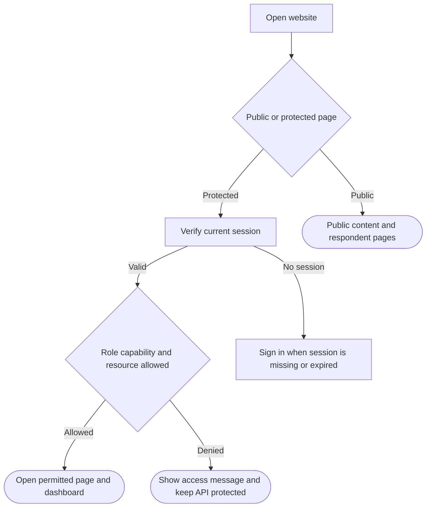
```mermaid
flowchart TD
%% flow_id=entry
    public["Open website"]
    choice{"Public or protected page"}
    session["Verify current session"]
    access{"Role capability and resource allowed"}
    dashboard(["Open permitted page and dashboard"])
    website(["Public content and respondent pages"])
    login["Sign in when session is missing or expired"]
    denied(["Show access message and keep API protected"])
    public --> choice
    choice -->|"Public"| website
    choice -->|"Protected"| session
    session -->|"No session"| login
    session -->|"Valid"| access
    access -->|"Allowed"| dashboard
    access -->|"Denied"| denied
```

Menu visibility does not replace backend authorization. An inaccessible role resource remains protected when its address is typed directly.

### Flow 02 Login activity and automatic sign out

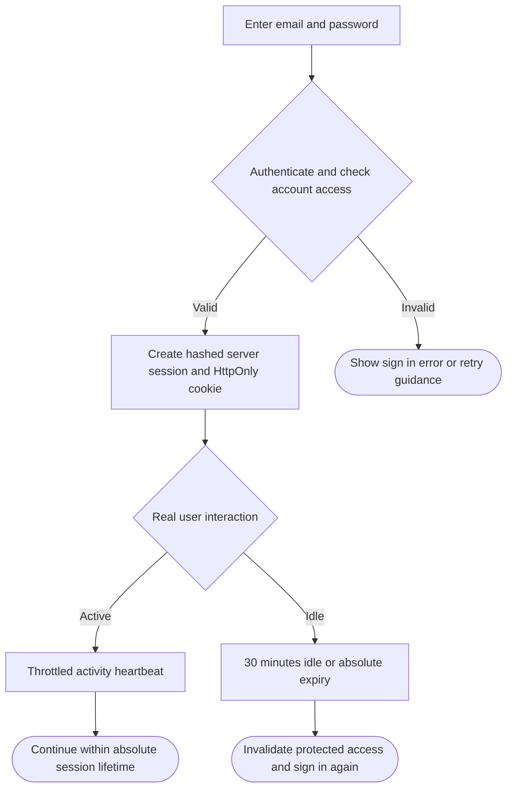
```mermaid
flowchart TD
%% flow_id=session
    credentials["Enter email and password"]
    verified{"Authenticate and check account access"}
    cookie["Create hashed server session and HttpOnly cookie"]
    activity{"Real user interaction"}
    heartbeat["Throttled activity heartbeat"]
    continue(["Continue within absolute session lifetime"])
    rejected(["Show sign in error or retry guidance"])
    idle["30 minutes idle or absolute expiry"]
    logout(["Invalidate protected access and sign in again"])
    credentials --> verified
    verified -->|"Valid"| cookie
    verified -->|"Invalid"| rejected
    cookie --> activity
    activity -->|"Active"| heartbeat
    heartbeat --> continue
    activity -->|"Idle"| idle
    idle --> logout
```

Ordinary sessions have a 12 hour absolute maximum and remembered sessions seven days. Background checks do not count as activity.

### Flow 03 Administrator password setup and change

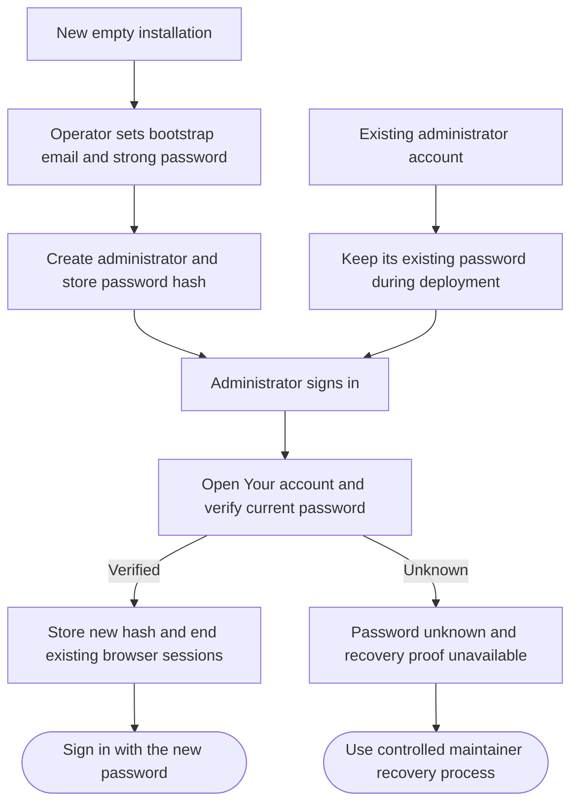
```mermaid
flowchart TD
%% flow_id=password
    install["New empty installation"]
    bootstrap["Operator sets bootstrap email and strong password"]
    stored["Create administrator and store password hash"]
    login["Administrator signs in"]
    change["Open Your account and verify current password"]
    save["Store new hash and end existing browser sessions"]
    again(["Sign in with the new password"])
    existing["Existing administrator account"]
    same["Keep its existing password during deployment"]
    unknown["Password unknown and recovery proof unavailable"]
    recovery(["Use controlled maintainer recovery process"])
    install --> bootstrap
    bootstrap --> stored
    stored --> login
    login --> change
    change -->|"Verified"| save
    save --> again
    existing --> same
    same --> login
    change -->|"Unknown"| unknown
    unknown --> recovery
```

There is no universal published production password. Changing Bootstrap__Password does not reset an existing administrator.

### Flow 04 Role permission resource and dashboard assignment

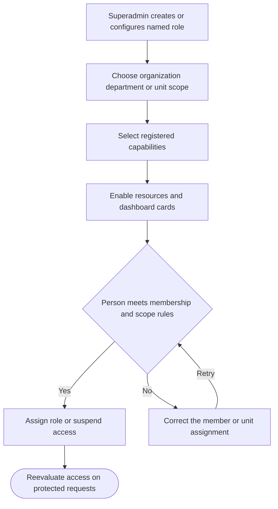
```mermaid
flowchart TD
%% flow_id=roles
    create["Superadmin creates or configures named role"]
    scope["Choose organization department or unit scope"]
    rights["Select registered capabilities"]
    presentation["Enable resources and dashboard cards"]
    eligible{"Person meets membership and scope rules"}
    assign["Assign role or suspend access"]
    enforce(["Reevaluate access on protected requests"])
    repair["Correct the member or unit assignment"]
    create --> scope
    scope --> rights
    rights --> presentation
    presentation --> eligible
    eligible -->|"Yes"| assign
    eligible -->|"No"| repair
    repair -->|"Retry"| eligible
    assign --> enforce
```

Custom permissions bundle supported capabilities. A new permission label cannot create new application behavior. The final active Superadmin is protected.

### Flow 05 Member unit group and content team setup

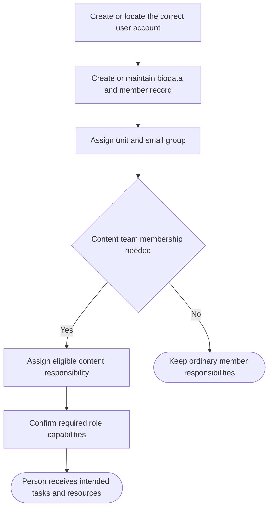
```mermaid
flowchart TD
%% flow_id=people
    user["Create or locate the correct user account"]
    profile["Create or maintain biodata and member record"]
    unit["Assign unit and small group"]
    content{"Content team membership needed"}
    team["Assign eligible content responsibility"]
    permissions["Confirm required role capabilities"]
    ready(["Person receives intended tasks and resources"])
    ordinary(["Keep ordinary member responsibilities"])
    user --> profile
    profile --> unit
    unit --> content
    content -->|"Yes"| team
    content -->|"No"| ordinary
    team --> permissions
    permissions --> ready
```

User accounts, biodata, member links and roles are different records. A content role does not grant a publishing capability by itself.

### Flow 06 Media hierarchy corrections and final approval

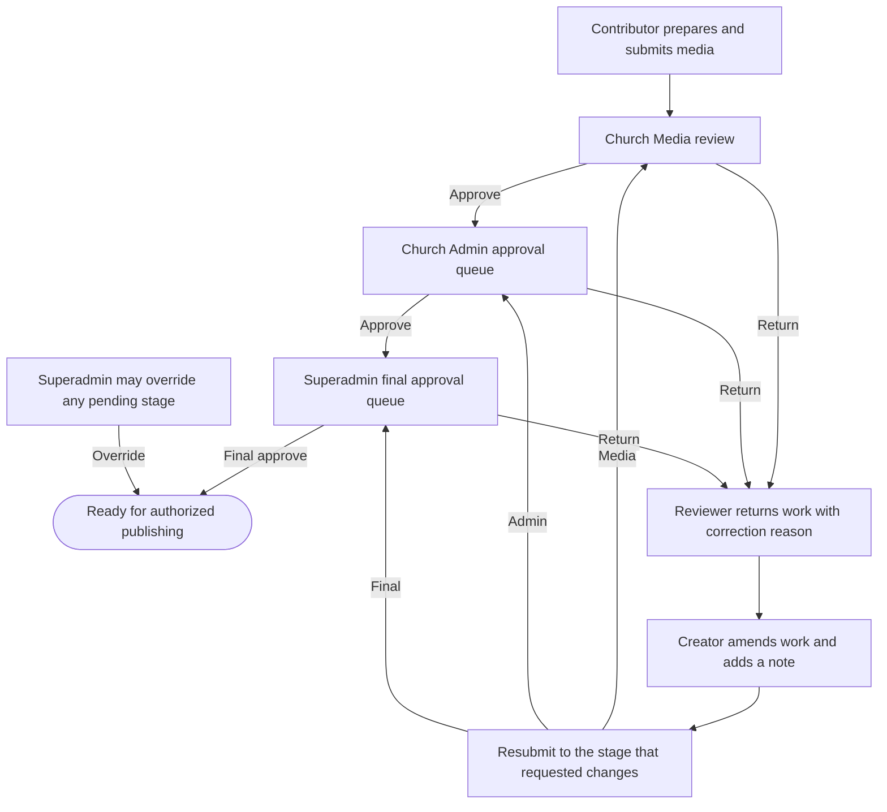
```mermaid
flowchart TD
%% flow_id=media
    create["Contributor prepares and submits media"]
    media["Church Media review"]
    admin["Church Admin approval queue"]
    super["Superadmin final approval queue"]
    ready(["Ready for authorized publishing"])
    return["Reviewer returns work with correction reason"]
    amend["Creator amends work and adds a note"]
    resubmit["Resubmit to the stage that requested changes"]
    override["Superadmin may override any pending stage"]
    create --> media
    media -->|"Approve"| admin
    admin -->|"Approve"| super
    super -->|"Final approve"| ready
    media -->|"Return"| return
    admin -->|"Return"| return
    super -->|"Return"| return
    return --> amend
    amend --> resubmit
    resubmit -->|"Media"| media
    resubmit -->|"Admin"| admin
    resubmit -->|"Final"| super
    override -->|"Override"| ready
```

Church Media starts its own submission at Church Admin. Church Admin starts at Superadmin. Contributor corrections from media review return to Church Media; corrections from later stages return to the requesting stage.

### Flow 07 Program flyer and public event publication

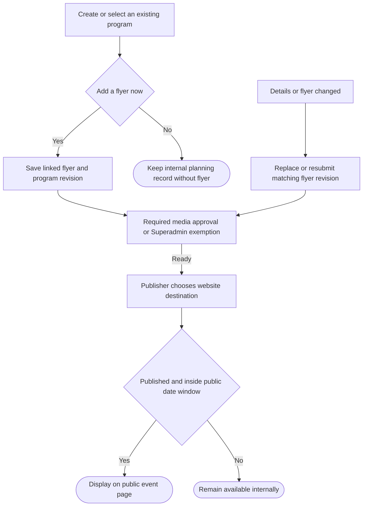
```mermaid
flowchart TD
%% flow_id=events
    program["Create or select an existing program"]
    flyer{"Add a flyer now"}
    submit["Save linked flyer and program revision"]
    review["Required media approval or Superadmin exemption"]
    publish["Publisher chooses website destination"]
    window{"Published and inside public date window"}
    public(["Display on public event page"])
    planning(["Keep internal planning record without flyer"])
    revision["Details or flyer changed"]
    again["Replace or resubmit matching flyer revision"]
    internal(["Remain available internally"])
    program --> flyer
    flyer -->|"No"| planning
    flyer -->|"Yes"| submit
    submit --> review
    review -->|"Ready"| publish
    publish --> window
    window -->|"Yes"| public
    window -->|"No"| internal
    revision --> again
    again --> review
```

Approval and website publication are separate. Only eligible public events are listed in the upcoming two calendar month window.

### Flow 08 Independent website and social publication

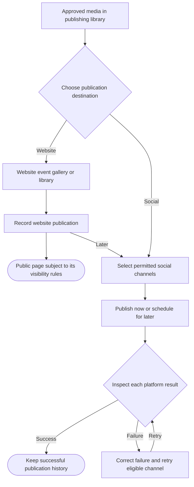
```mermaid
flowchart TD
%% flow_id=publishing
    eligible["Approved media in publishing library"]
    choice{"Choose publication destination"}
    website["Website event gallery or library"]
    stored["Record website publication"]
    visible(["Public page subject to its visibility rules"])
    social["Select permitted social channels"]
    when["Publish now or schedule for later"]
    result{"Inspect each platform result"}
    history(["Keep successful publication history"])
    retry["Correct failure and retry eligible channel"]
    eligible --> choice
    choice -->|"Website"| website
    website --> stored
    stored --> visible
    choice -->|"Social"| social
    stored -->|"Later"| social
    social --> when
    when --> result
    result -->|"Success"| history
    result -->|"Failure"| retry
    retry -->|"Retry"| result
```

An event can be published to the website first and shared to social later. Social sharing does not require publishing the website event again.

### Flow 09 Social and community moderation

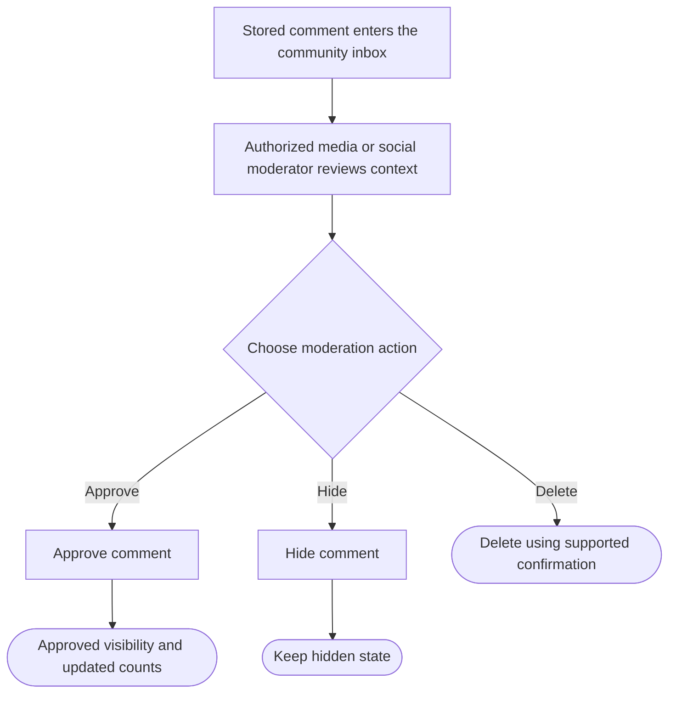
```mermaid
flowchart TD
%% flow_id=moderation
    comment["Stored comment enters the community inbox"]
    review["Authorized media or social moderator reviews context"]
    decision{"Choose moderation action"}
    approve["Approve comment"]
    visible(["Approved visibility and updated counts"])
    hide["Hide comment"]
    hidden(["Keep hidden state"])
    delete(["Delete using supported confirmation"])
    comment --> review
    review --> decision
    decision -->|"Approve"| approve
    approve --> visible
    decision -->|"Hide"| hide
    hide --> hidden
    decision -->|"Delete"| delete
```

Built in Church Admin and Superadmin are excluded from comment moderation. Publishing channel permissions are separate from moderation.

### Flow 10 Appointment request review and confirmation

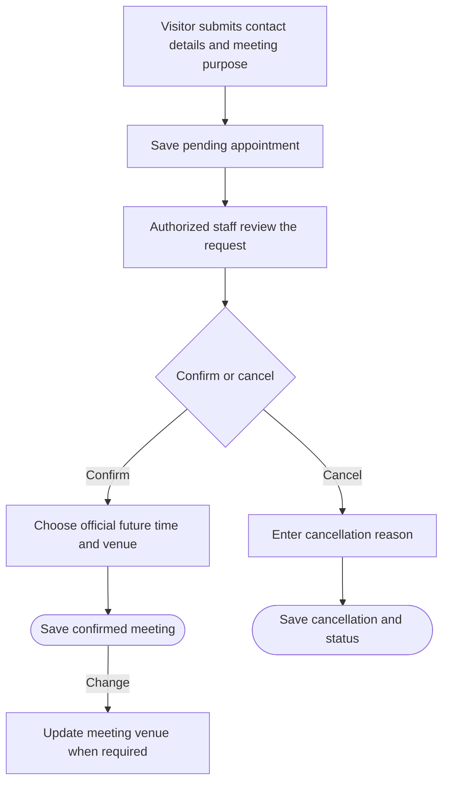
```mermaid
flowchart TD
%% flow_id=appointments
    request["Visitor submits contact details and meeting purpose"]
    pending["Save pending appointment"]
    review["Authorized staff review the request"]
    decision{"Confirm or cancel"}
    confirm["Choose official future time and venue"]
    confirmed(["Save confirmed meeting"])
    cancel["Enter cancellation reason"]
    cancelled(["Save cancellation and status"])
    venue["Update meeting venue when required"]
    request --> pending
    pending --> review
    review --> decision
    decision -->|"Confirm"| confirm
    confirm --> confirmed
    decision -->|"Cancel"| cancel
    cancel --> cancelled
    confirmed -->|"Change"| venue
```

A successful public request is not an automatically confirmed meeting. Search and page through persisted appointments using the administrative view.

### Flow 11 Requisition validation and approval

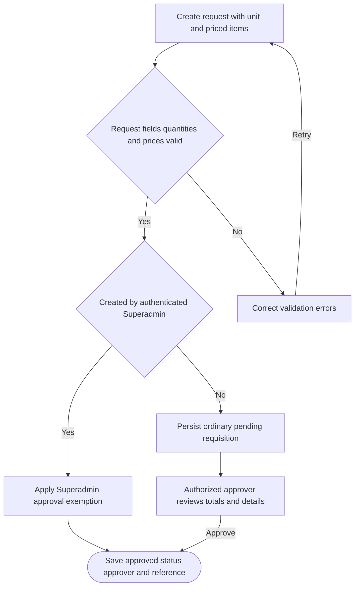
```mermaid
flowchart TD
%% flow_id=requisitions
    request["Create request with unit and priced items"]
    valid{"Request fields quantities and prices valid"}
    root{"Created by authenticated Superadmin"}
    pending["Persist ordinary pending requisition"]
    review["Authorized approver reviews totals and details"]
    approved(["Save approved status approver and reference"])
    correct["Correct validation errors"]
    exempt["Apply Superadmin approval exemption"]
    request --> valid
    valid -->|"Yes"| root
    valid -->|"No"| correct
    correct -->|"Retry"| request
    root -->|"No"| pending
    root -->|"Yes"| exempt
    exempt --> approved
    pending --> review
    review -->|"Approve"| approved
```

The record is an operational request and approval. It does not prove that money was disbursed or goods were received.

### Flow 12 Giving account administration and public use

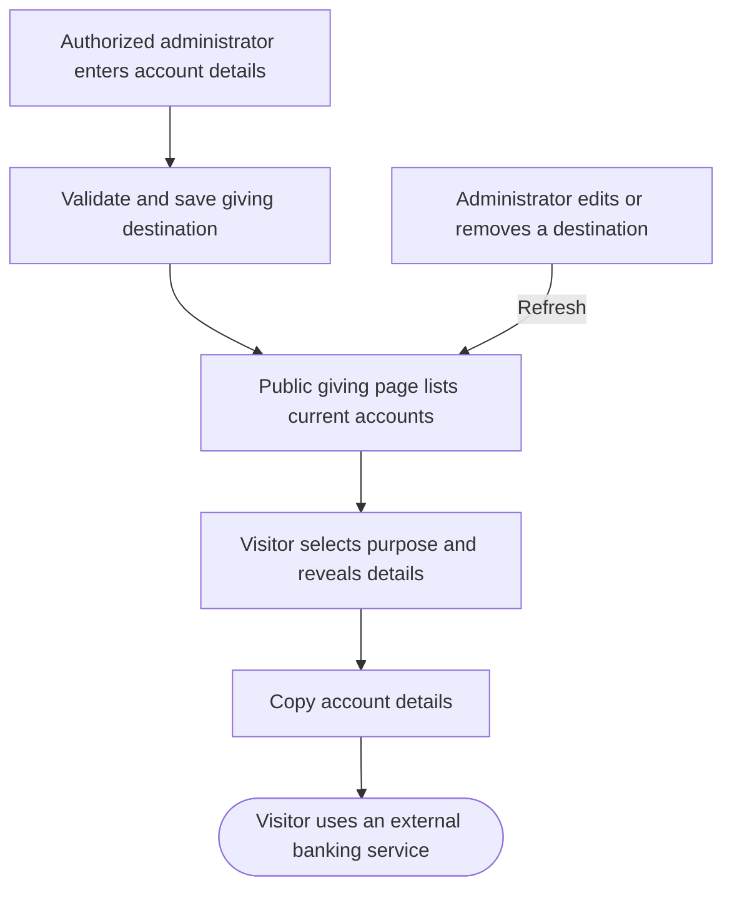
```mermaid
flowchart TD
%% flow_id=giving
    admin["Authorized administrator enters account details"]
    save["Validate and save giving destination"]
    public["Public giving page lists current accounts"]
    choose["Visitor selects purpose and reveals details"]
    copy["Copy account details"]
    external(["Visitor uses an external banking service"])
    update["Administrator edits or removes a destination"]
    admin --> save
    save --> public
    public --> choose
    choose --> copy
    copy --> external
    update -->|"Refresh"| public
```

The app displays giving instructions and account records. Copying an account number does not execute or reconcile a transfer.

### Flow 13 Form creation questions sections and theme

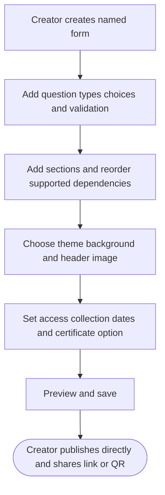
```mermaid
flowchart TD
%% flow_id=builder
    create["Creator creates named form"]
    questions["Add question types choices and validation"]
    sections["Add sections and reorder supported dependencies"]
    theme["Choose theme background and header image"]
    settings["Set access collection dates and certificate option"]
    preview["Preview and save"]
    publish(["Creator publishes directly and shares link or QR"])
    create --> questions
    questions --> sections
    sections --> theme
    theme --> settings
    settings --> preview
    preview --> publish
```

Ordinary form publication has no approval queue. Save persists the definition; publication is a separate explicit action.

### Flow 14 Form collection lifecycle and date window

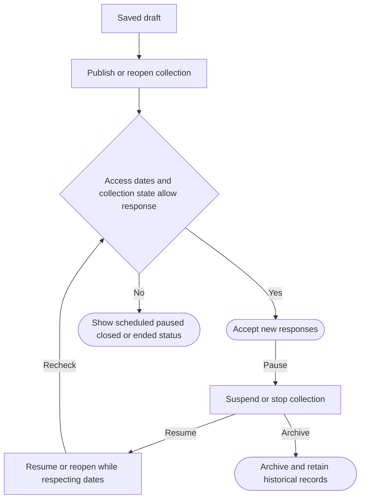
```mermaid
flowchart TD
%% flow_id=collection
    draft["Saved draft"]
    publish["Publish or reopen collection"]
    gate{"Access dates and collection state allow response"}
    open(["Accept new responses"])
    closed(["Show scheduled paused closed or ended status"])
    suspend["Suspend or stop collection"]
    resume["Resume or reopen while respecting dates"]
    archive(["Archive and retain historical records"])
    draft --> publish
    publish --> gate
    gate -->|"Yes"| open
    gate -->|"No"| closed
    open -->|"Pause"| suspend
    suspend -->|"Resume"| resume
    resume -->|"Recheck"| gate
    suspend -->|"Archive"| archive
```

Opening and closing instants are stored in UTC and enforced on API requests. A worker is not needed to close a timed form.

### Flow 15 Respondent access validation and saved receipt

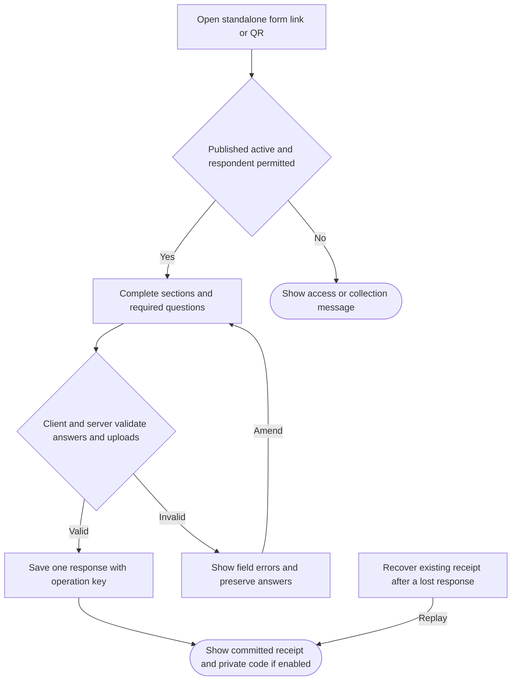
```mermaid
flowchart TD
%% flow_id=response
    link["Open standalone form link or QR"]
    allowed{"Published active and respondent permitted"}
    sections["Complete sections and required questions"]
    validate{"Client and server validate answers and uploads"}
    commit["Save one response with operation key"]
    receipt(["Show committed receipt and private code if enabled"])
    blocked(["Show access or collection message"])
    correct["Show field errors and preserve answers"]
    retry["Recover existing receipt after a lost response"]
    link --> allowed
    allowed -->|"Yes"| sections
    allowed -->|"No"| blocked
    sections --> validate
    validate -->|"Valid"| commit
    validate -->|"Invalid"| correct
    correct -->|"Amend"| sections
    commit --> receipt
    retry -->|"Replay"| receipt
```

The receipt represents a saved response. A page visit does not increase the response badge and a repeated operation key must not create a duplicate.

### Flow 16 Response review question analysis and export

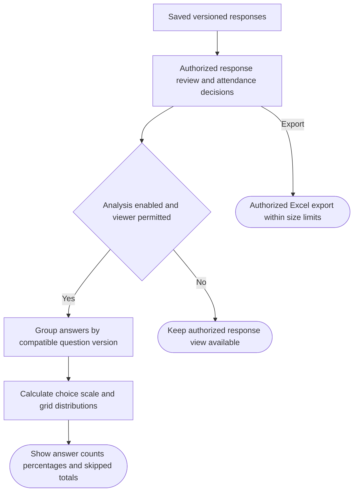
```mermaid
flowchart TD
%% flow_id=analysis
    saved["Saved versioned responses"]
    review["Authorized response review and attendance decisions"]
    enabled{"Analysis enabled and viewer permitted"}
    group["Group answers by compatible question version"]
    stats["Calculate choice scale and grid distributions"]
    charts(["Show answer counts percentages and skipped totals"])
    answers(["Keep authorized response view available"])
    export(["Authorized Excel export within size limits"])
    saved --> review
    review --> enabled
    enabled -->|"Yes"| group
    enabled -->|"No"| answers
    group --> stats
    stats --> charts
    review -->|"Export"| export
```

Multiple selections can total more than 100 percent. Skipped questions are not No answers. Historical question definitions are preserved.

### Flow 17 Creator managed training certificate issuance

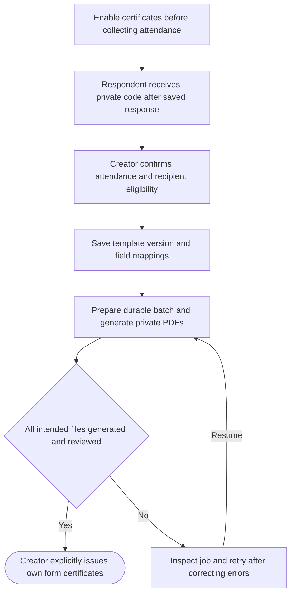
```mermaid
flowchart TD
%% flow_id=training
    enabled["Enable certificates before collecting attendance"]
    receipt["Respondent receives private code after saved response"]
    eligible["Creator confirms attendance and recipient eligibility"]
    template["Save template version and field mappings"]
    prepare["Prepare durable batch and generate private PDFs"]
    complete{"All intended files generated and reviewed"}
    issue(["Creator explicitly issues own form certificates"])
    wait["Inspect job and retry after correcting errors"]
    enabled --> receipt
    receipt --> eligible
    eligible --> template
    template --> prepare
    prepare --> complete
    complete -->|"Yes"| issue
    complete -->|"No"| wait
    wait -->|"Resume"| prepare
```

This creator owned training path has no separate church administrator approval. Up to 1000 recipients can be prepared per batch.

### Flow 18 Church wide certificate generation and approval

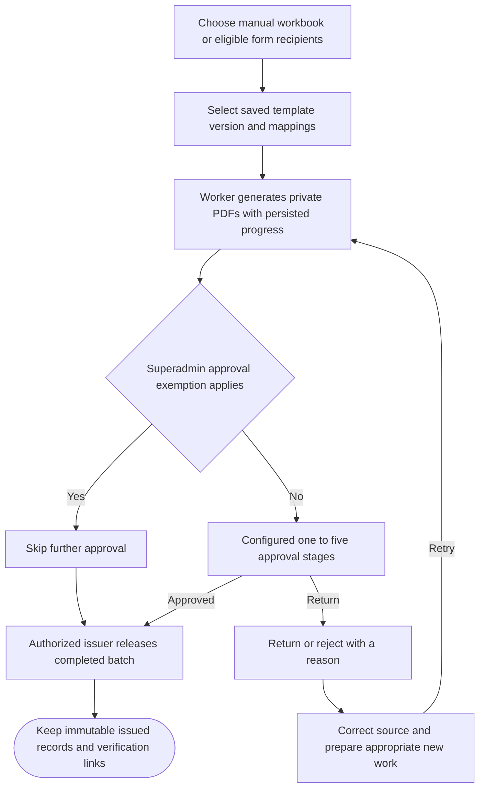
```mermaid
flowchart TD
%% flow_id=batch
    recipients["Choose manual workbook or eligible form recipients"]
    template["Select saved template version and mappings"]
    generate["Worker generates private PDFs with persisted progress"]
    root{"Superadmin approval exemption applies"}
    review["Configured one to five approval stages"]
    issue["Authorized issuer releases completed batch"]
    issued(["Keep immutable issued records and verification links"])
    direct["Skip further approval"]
    return["Return or reject with a reason"]
    amend["Correct source and prepare appropriate new work"]
    recipients --> template
    template --> generate
    generate --> root
    root -->|"No"| review
    root -->|"Yes"| direct
    direct --> issue
    review -->|"Approved"| issue
    review -->|"Return"| return
    return --> amend
    amend -->|"Retry"| generate
    issue --> issued
```

Church wide approval settings do not impose approval on ordinary form publication or creator managed training issuance. Incomplete generation cannot be issued.

### Flow 19 Private certificate download and public verification

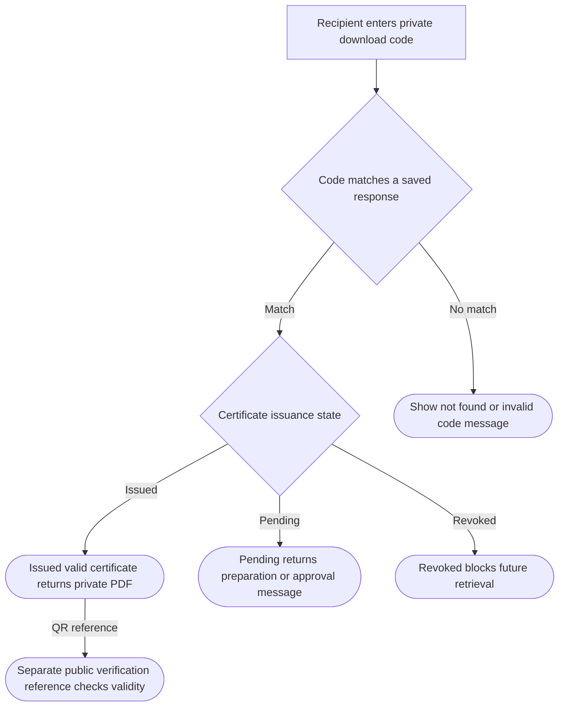
```mermaid
flowchart TD
%% flow_id=retrieval
    code["Recipient enters private download code"]
    valid{"Code matches a saved response"}
    state{"Certificate issuance state"}
    pdf(["Issued valid certificate returns private PDF"])
    missing(["Show not found or invalid code message"])
    pending(["Pending returns preparation or approval message"])
    revoked(["Revoked blocks future retrieval"])
    verify(["Separate public verification reference checks validity"])
    code --> valid
    valid -->|"Match"| state
    valid -->|"No match"| missing
    state -->|"Issued"| pdf
    state -->|"Pending"| pending
    state -->|"Revoked"| revoked
    pdf -->|"QR reference"| verify
```

The public verification token and private download code are separate. Revocation cannot remove a file already downloaded to another device.

### Flow 20 Report synchronization period selection and export

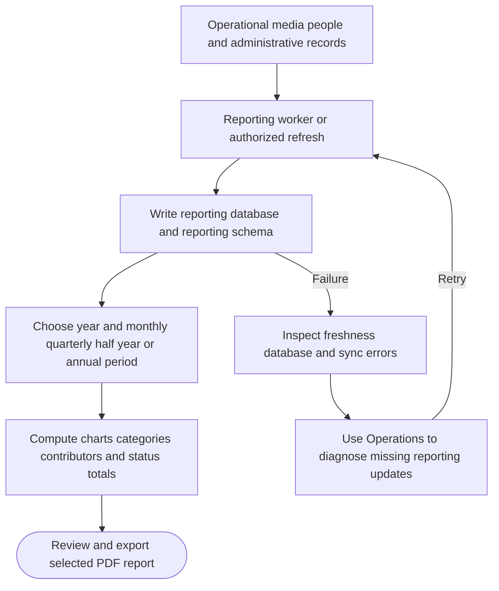
```mermaid
flowchart TD
%% flow_id=reports
    source["Operational media people and administrative records"]
    sync["Reporting worker or authorized refresh"]
    database["Write reporting database and reporting schema"]
    period["Choose year and monthly quarterly half year or annual period"]
    summary["Compute charts categories contributors and status totals"]
    export(["Review and export selected PDF report"])
    stale["Inspect freshness database and sync errors"]
    operations["Use Operations to diagnose missing reporting updates"]
    source --> sync
    sync --> database
    database --> period
    period --> summary
    summary --> export
    database -->|"Failure"| stale
    stale --> operations
    operations -->|"Retry"| sync
```

An empty report may mean no records, the wrong period or stale reporting data. Refresh does not authorize editing source records to force a total.

### Flow 21 Service monitoring background jobs and retry

```mermaid
flowchart TD
%% flow_id=operations
    observe["Collect API database reporting and certificate measurements"]
    store["Persist samples and worker heartbeat"]
    display["Choose monitoring window and inspect chart units"]
    failed{"Background job failed or stalled"}
    diagnose["Inspect error inputs storage renderer and worker"]
    retry["Authorized retry of the existing durable job"]
    complete(["Worker renews lease and records progress or completion"])
    healthy(["Continue monitoring actual observations"])
    observe --> store
    store --> display
    display --> failed
    failed -->|"Yes"| diagnose
    failed -->|"No"| healthy
    diagnose -->|"Correct cause"| retry
    retry --> complete
```

Monitoring history is retained for seven days. Missing current samples are Waiting. Retries do not replace diagnosing a persistent failure.

### Flow 22 Settings validation save and public presentation

```mermaid
flowchart TD
%% flow_id=settings
    edit["Edit permitted hero live contact or chatbot settings"]
    authorize{"Verify session origin and capability"}
    validate{"Validate URLs media dimensions and field limits"}
    save["Persist settings in the intended backend"]
    read["Public server routes read the same backend"]
    display(["Render updated public presentation"])
    denied(["Reject unauthorized write"])
    correct["Show validation error and correct fields"]
    edit --> authorize
    authorize -->|"Allowed"| validate
    authorize -->|"Denied"| denied
    validate -->|"Valid"| save
    validate -->|"Invalid"| correct
    correct -->|"Amend"| edit
    save --> read
    read --> display
```

All streams off and cleared contact links can be valid saved settings. Provider access tokens are not public settings and are preserved during deployment.

### Flow 23 Migrations release acceptance and monitoring

```mermaid
flowchart TD
%% flow_id=release
    backup["Back up data and preserve deployment secrets"]
    main["Review and apply main context migrations"]
    reporting["Apply reporting context migrations separately"]
    api["Deploy API and verify liveness and readiness"]
    worker["Start compatible workers and verify native dependencies"]
    ui["Deploy frontend with exact public origin and API URL"]
    accept(["Run authorized acceptance checks and monitor"])
    failure["A release stage or health check fails"]
    diagnose["Inspect final error and correct configuration"]
    rollback["Use reviewed compatible rollback or restore plan"]
    backup --> main
    main --> reporting
    reporting --> api
    api -->|"Healthy"| worker
    worker --> ui
    ui --> accept
    api -->|"Failure"| failure
    failure --> diagnose
    diagnose -->|"If needed"| rollback
```

A code release does not overwrite existing social secrets or certificate keys. Do not run destructive database rollback without a reviewed recovery plan.

### Flow 24 Audit records diagnostic logs and support

```mermaid
flowchart TD
%% flow_id=audit
    action["User action or service request"]
    decision{"What evidence is required"}
    audit["Recorded administrative action and actor"]
    history(["Preserve accountability history"])
    logs["Runtime request error and correlation identifier"]
    diagnose["Match safe request details and investigate"]
    retain(["Rotate diagnostic logs with bounded retention"])
    action --> decision
    decision -->|"Who changed"| audit
    audit --> history
    decision -->|"Why failed"| logs
    logs --> diagnose
    diagnose --> retain
```

Clearing a console log is different from deleting an audit trail or database. Support reports must not contain passwords, cookies or private certificate codes.

End of manual.
